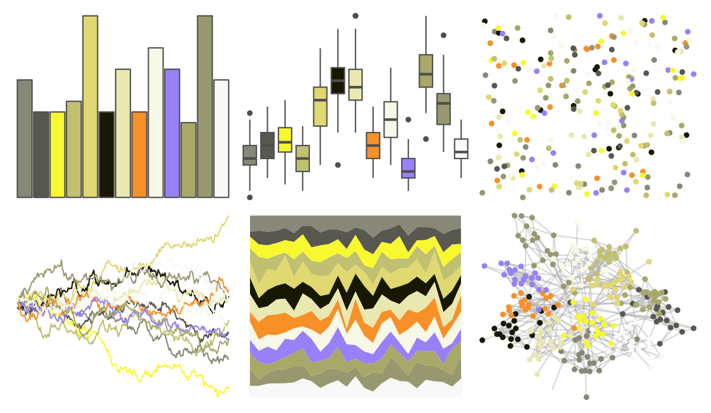
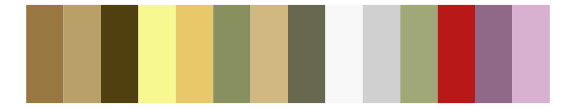

# palettetown - beautifly 

::: columns
::: {.column width="50%"}

**Github**

[timcdlucas/palettetown](https://github.com/timcdlucas/palettetown)
:::

::: {.column width="50%"}

**CRAN**

[palettetown](https://CRAN.R-project.org/package=palettetown)
:::
:::

<hr> 

Use with [paletteer](https://emilhvitfeldt.github.io/paletteer/) package:

```r
library(paletteer)
paletteer_d("palettetown::beautifly")
```

Use raw:

```r
c("#888878FF", "#585850FF", "#F8F830FF", "#C0C070FF", "#E0D870FF", "#181800FF", "#E8E8B0FF", "#F89028FF", "#F8F8E8FF", "#9880F8FF", "#A8A868FF", "#989870FF", "#F8F8F8FF")
``` 

 

<br>

# Related Palettes

<div class="list" style="display: grid; grid-template-columns: auto auto auto;"> <figure class="figure">
<a href="../../awtools/a_palette/"> </a>
</figure> <figure class="figure">
<a href="../../ButterflyColors/hamadryas_feronia/"> </a>
</figure> <figure class="figure">
<a href="../../ButterflyColors/hamadryas_feronia/"> </a>
</figure> <figure class="figure">
<a href="../../palettetown/wurmple/"> </a>
</figure> <figure class="figure">
<a href="../../palettetown/tropius/"> </a>
</figure> <figure class="figure">
<a href="../../palettetown/ursaring/"> </a>
</figure> <figure class="figure">
<a href="../../palettetown/ludicolo/"> </a>
</figure> <figure class="figure">
<a href="../../palettetown/tauros/"> </a>
</figure> <figure class="figure">
<a href="../../palettetown/trapinch/"> </a>
</figure> <figure class="figure">
<a href="../../palettetown/rayquaza/"> </a>
</figure> <figure class="figure">
<a href="../../palettetown/hoothoot/"> </a>
</figure> <figure class="figure">
<a href="../../palettetown/kangaskhan/"> </a>
</figure> 
</div>
