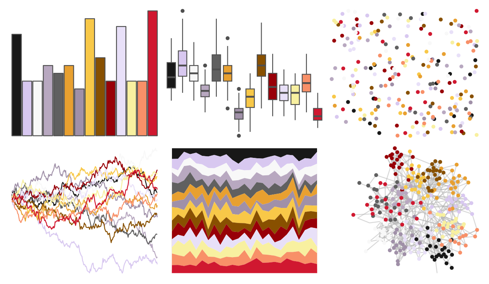

# palettetown - beedrill 

::: columns
::: {.column width="50%"}

**Github**

[timcdlucas/palettetown](https://github.com/timcdlucas/palettetown)
:::

::: {.column width="50%"}

**CRAN**

[palettetown](https://CRAN.R-project.org/package=palettetown)
:::
:::

<hr> 

Use with [paletteer](https://emilhvitfeldt.github.io/paletteer/) package:

```r
library(paletteer)
paletteer_d("palettetown::beedrill")
```

Use raw:

```r
c("#181818FF", "#D8C8F0FF", "#F8F8F8FF", "#B8A8C0FF", "#606060FF", "#E8A030FF", "#A090A8FF", "#F8C848FF", "#885000FF", "#980008FF", "#E8E0F8FF", "#F8F0A0FF", "#F89068FF", "#D01830FF")
``` 

 

<br>

# Related Palettes

<div class="list" style="display: grid; grid-template-columns: auto auto auto;"> <figure class="figure">
<a href="../../amerika/Dem_Ind_Rep3/"> </a>
</figure> <figure class="figure">
<a href="../../palettetown/snorunt/"> </a>
</figure> <figure class="figure">
<a href="../../palettetown/weedle/"> </a>
</figure> <figure class="figure">
<a href="../../palettetown/sneasel/"> </a>
</figure> <figure class="figure">
<a href="../../palettetown/pidgeotto/"> </a>
</figure> <figure class="figure">
<a href="../../palettetown/weezing/"> </a>
</figure> <figure class="figure">
<a href="../../palettetown/ampharos/"> </a>
</figure> <figure class="figure">
<a href="../../palettetown/camerupt/"> </a>
</figure> <figure class="figure">
<a href="../../palettetown/primeape/"> </a>
</figure> <figure class="figure">
<a href="../../palettetown/dodrio/"> </a>
</figure> <figure class="figure">
<a href="../../palettetown/spearow/"> </a>
</figure> <figure class="figure">
<a href="../../palettetown/medicham/"> </a>
</figure> 
</div>
