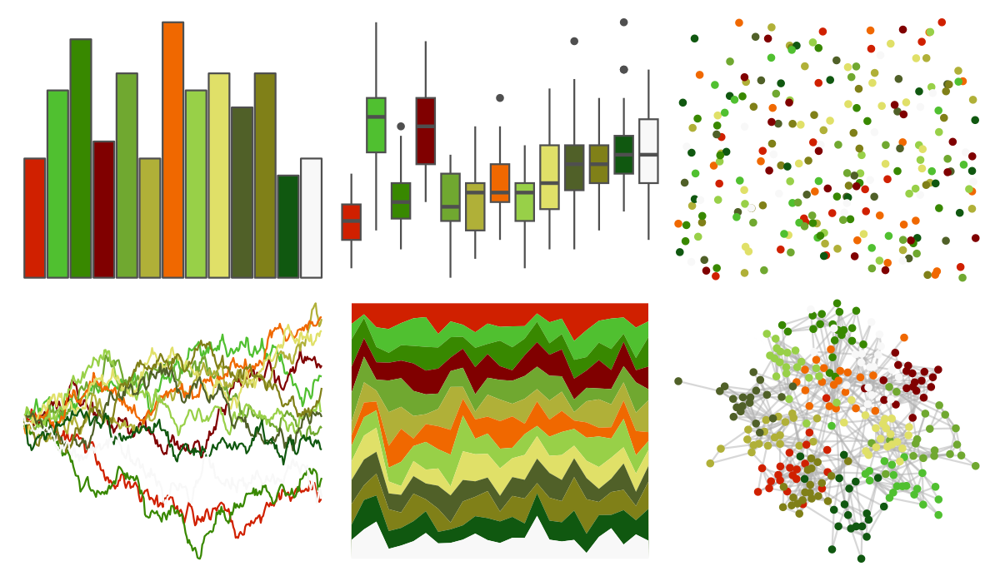
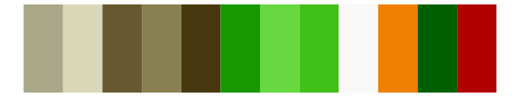

# palettetown - bellossom 

::: columns
::: {.column width="50%"}

**Github**

[timcdlucas/palettetown](https://github.com/timcdlucas/palettetown)
:::

::: {.column width="50%"}

**CRAN**

[palettetown](https://CRAN.R-project.org/package=palettetown)
:::
:::

<hr> 

Use with [paletteer](https://emilhvitfeldt.github.io/paletteer/) package:

```r
library(paletteer)
paletteer_d("palettetown::bellossom")
```

Use raw:

```r
c("#D02000FF", "#50C030FF", "#388800FF", "#800000FF", "#70A830FF", "#B0B038FF", "#F06800FF", "#98D048FF", "#E0E068FF", "#506028FF", "#808018FF", "#105810FF", "#F8F8F8FF")
``` 

 

<br>

# Related Palettes

<div class="list" style="display: grid; grid-template-columns: auto auto auto;"> <figure class="figure">
<a href="../../amerika/Dem_Ind_Rep3/"> </a>
</figure> <figure class="figure">
<a href="../../palettetown/smeargle/"> </a>
</figure> <figure class="figure">
<a href="../../palettetown/bayleef/"> </a>
</figure> <figure class="figure">
<a href="../../palettetown/spinarak/"> </a>
</figure> <figure class="figure">
<a href="../../palettetown/bellsprout/"> </a>
</figure> <figure class="figure">
<a href="../../palettetown/sceptile/"> </a>
</figure> <figure class="figure">
<a href="../../palettetown/weepinbell/"> </a>
</figure> <figure class="figure">
<a href="../../palettetown/treecko/"> </a>
</figure> <figure class="figure">
<a href="../../palettetown/venusaur/"> </a>
</figure> <figure class="figure">
<a href="../../palettetown/politoed/"> </a>
</figure> <figure class="figure">
<a href="../../palettetown/ho_oh/"> </a>
</figure> <figure class="figure">
<a href="../../palettetown/lombre/"> </a>
</figure> 
</div>
