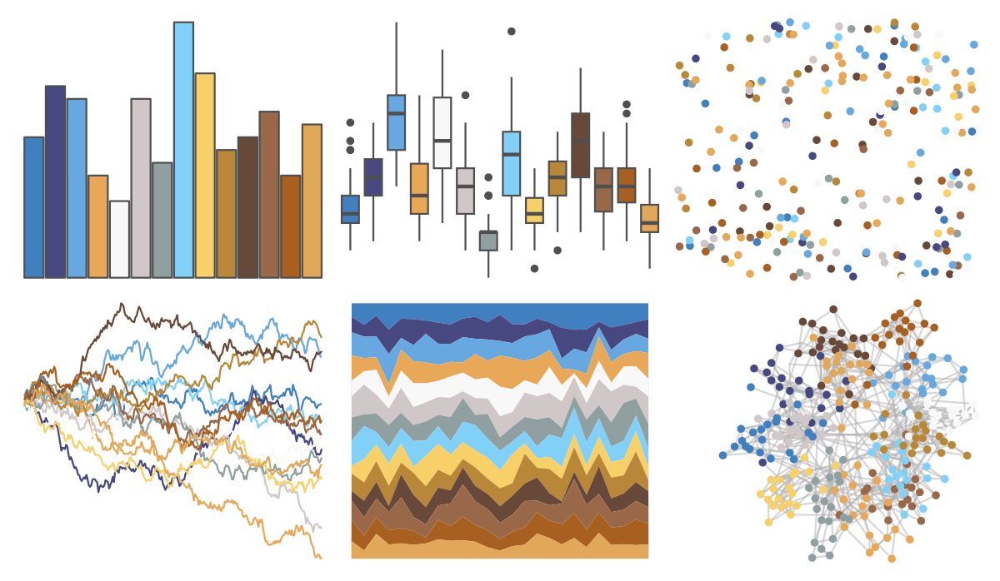

# palettetown - blastoise 

::: columns
::: {.column width="50%"}

**Github**

[timcdlucas/palettetown](https://github.com/timcdlucas/palettetown)
:::

::: {.column width="50%"}

**CRAN**

[palettetown](https://CRAN.R-project.org/package=palettetown)
:::
:::

<hr> 

Use with [paletteer](https://emilhvitfeldt.github.io/paletteer/) package:

```r
library(paletteer)
paletteer_d("palettetown::blastoise")
```

Use raw:

```r
c("#4080C0FF", "#484880FF", "#68A8E0FF", "#E8A858FF", "#F8F8F8FF", "#D0C8C8FF", "#90A0A0FF", "#80D0F8FF", "#F8D068FF", "#B88838FF", "#684838FF", "#986848FF", "#A86020FF", "#E0A858FF")
``` 

 

<br>

# Related Palettes

<div class="list" style="display: grid; grid-template-columns: auto auto auto;"> <figure class="figure">
<a href="../../amerika/Dem_Ind_Rep3/"> </a>
</figure> <figure class="figure">
<a href="../../palettetown/snorlax/"> </a>
</figure> <figure class="figure">
<a href="../../palettetown/wartortle/"> </a>
</figure> <figure class="figure">
<a href="../../IslamicArt/shiraz2/"> </a>
</figure> <figure class="figure">
<a href="../../palettetown/butterfree/"> </a>
</figure> <figure class="figure">
<a href="../../palettetown/seel/"> </a>
</figure> <figure class="figure">
<a href="../../palettetown/latias/"> </a>
</figure> <figure class="figure">
<a href="../../palettetown/surskit/"> </a>
</figure> <figure class="figure">
<a href="../../ggthemes/stata_s2color/"> </a>
</figure> <figure class="figure">
<a href="../../palettetown/mudkip/"> </a>
</figure> <figure class="figure">
<a href="../../palettetown/nidoqueen/"> </a>
</figure> <figure class="figure">
<a href="../../palettetown/weezing/"> </a>
</figure> 
</div>
