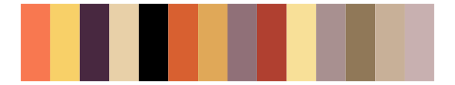
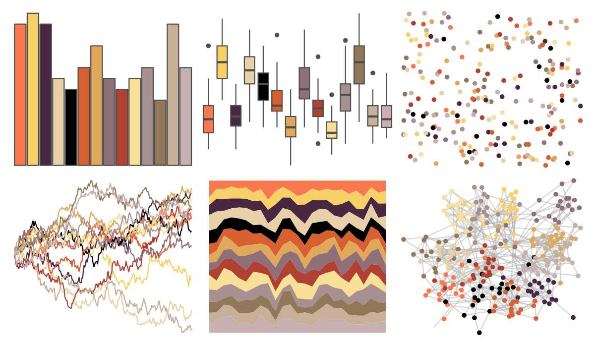
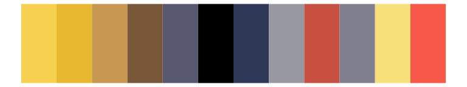
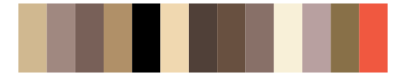
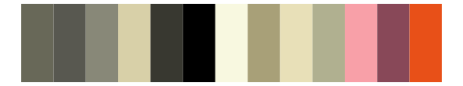
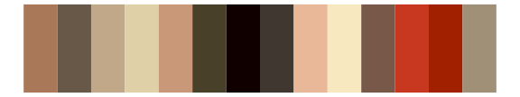
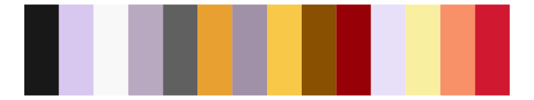
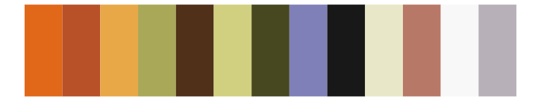
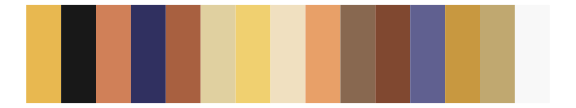

# palettetown - blaziken 

::: columns
::: {.column width="50%"}

**Github**

[timcdlucas/palettetown](https://github.com/timcdlucas/palettetown)
:::

::: {.column width="50%"}

**CRAN**

[palettetown](https://CRAN.R-project.org/package=palettetown)
:::
:::

<hr> 

Use with [paletteer](https://emilhvitfeldt.github.io/paletteer/) package:

```r
library(paletteer)
paletteer_d("palettetown::blaziken")
```

Use raw:

```r
c("#F87850FF", "#F8D068FF", "#482840FF", "#E8D0A8FF", "#000000FF", "#D86030FF", "#E0A858FF", "#907078FF", "#B04030FF", "#F8E098FF", "#A89090FF", "#907858FF", "#C8B098FF", "#C8B0B0FF")
``` 

 

<br>

# Related Palettes

<div class="list" style="display: grid; grid-template-columns: auto auto auto;"> <figure class="figure">
<a href="../../awtools/a_palette/"> </a>
</figure> <figure class="figure">
<a href="../../palettetown/makuhita/"> </a>
</figure> <figure class="figure">
<a href="../../palettetown/relicanth/"> </a>
</figure> <figure class="figure">
<a href="../../palettetown/duskull/"> </a>
</figure> <figure class="figure">
<a href="../../palettetown/solrock/"> </a>
</figure> <figure class="figure">
<a href="../../palettetown/weedle/"> </a>
</figure> <figure class="figure">
<a href="../../palettetown/primeape/"> </a>
</figure> <figure class="figure">
<a href="../../palettetown/zigzagoon/"> </a>
</figure> <figure class="figure">
<a href="../../palettetown/beedrill/"> </a>
</figure> <figure class="figure">
<a href="../../palettetown/camerupt/"> </a>
</figure> <figure class="figure">
<a href="../../palettetown/hariyama/"> </a>
</figure> <figure class="figure">
<a href="../../palettetown/ninjask/"> </a>
</figure> 
</div>
