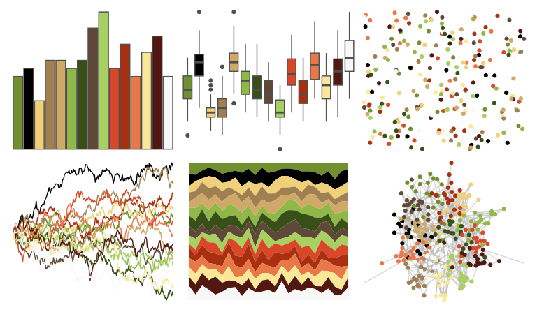

# palettetown - breloom 

::: columns
::: {.column width="50%"}

**Github**

[timcdlucas/palettetown](https://github.com/timcdlucas/palettetown)
:::

::: {.column width="50%"}

**CRAN**

[palettetown](https://CRAN.R-project.org/package=palettetown)
:::
:::

<hr> 

Use with [paletteer](https://emilhvitfeldt.github.io/paletteer/) package:

```r
library(paletteer)
paletteer_d("palettetown::breloom")
```

Use raw:

```r
c("#709030FF", "#000000FF", "#F0D078FF", "#A08050FF", "#D0A868FF", "#90B848FF", "#385018FF", "#604838FF", "#A8D060FF", "#D84828FF", "#A83010FF", "#E87848FF", "#F8E898FF", "#501810FF", "#F8F8F8FF")
``` 

 

<br>

# Related Palettes

<div class="list" style="display: grid; grid-template-columns: auto auto auto;"> <figure class="figure">
<a href="../../awtools/a_palette/"> </a>
</figure> <figure class="figure">
<a href="../../palettetown/kecleon/"> </a>
</figure> <figure class="figure">
<a href="../../palettetown/primeape/"> </a>
</figure> <figure class="figure">
<a href="../../palettetown/cradily/"> </a>
</figure> <figure class="figure">
<a href="../../palettetown/xatu/"> </a>
</figure> <figure class="figure">
<a href="../../palettetown/corphish/"> </a>
</figure> <figure class="figure">
<a href="../../palettetown/trapinch/"> </a>
</figure> <figure class="figure">
<a href="../../palettetown/natu/"> </a>
</figure> <figure class="figure">
<a href="../../palettetown/plusle/"> </a>
</figure> <figure class="figure">
<a href="../../palettetown/sentret/"> </a>
</figure> <figure class="figure">
<a href="../../palettetown/wurmple/"> </a>
</figure> <figure class="figure">
<a href="../../palettetown/shiftry/"> </a>
</figure> 
</div>
