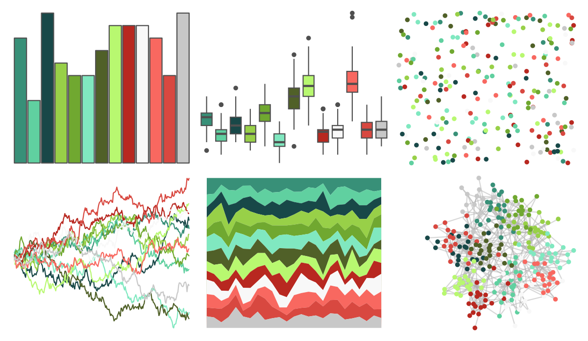

# palettetown - bulbasaur 

::: columns
::: {.column width="50%"}

**Github**

[timcdlucas/palettetown](https://github.com/timcdlucas/palettetown)
:::

::: {.column width="50%"}

**CRAN**

[palettetown](https://CRAN.R-project.org/package=palettetown)
:::
:::

<hr> 

Use with [paletteer](https://emilhvitfeldt.github.io/paletteer/) package:

```r
library(paletteer)
paletteer_d("palettetown::bulbasaur")
```

Use raw:

```r
c("#389078FF", "#60D0A0FF", "#184848FF", "#98D048FF", "#70A830FF", "#80E8C0FF", "#506028FF", "#B8F870FF", "#B82820FF", "#F8F8F8FF", "#F86860FF", "#D84840FF", "#C8C8C8FF")
``` 

 

<br>

# Related Palettes

<div class="list" style="display: grid; grid-template-columns: auto auto auto;"> <figure class="figure">
<a href="../../amerika/Dem_Ind_Rep3/"> </a>
</figure> <figure class="figure">
<a href="../../palettetown/ivysaur/"> </a>
</figure> <figure class="figure">
<a href="../../palettetown/machamp/"> </a>
</figure> <figure class="figure">
<a href="../../palettetown/venusaur/"> </a>
</figure> <figure class="figure">
<a href="../../palettetown/treecko/"> </a>
</figure> <figure class="figure">
<a href="../../palettetown/machop/"> </a>
</figure> <figure class="figure">
<a href="../../palettetown/rayquaza/"> </a>
</figure> <figure class="figure">
<a href="../../palettetown/xatu/"> </a>
</figure> <figure class="figure">
<a href="../../palettetown/natu/"> </a>
</figure> <figure class="figure">
<a href="../../palettetown/meganium/"> </a>
</figure> <figure class="figure">
<a href="../../palettetown/ludicolo/"> </a>
</figure> <figure class="figure">
<a href="../../palettetown/flygon/"> </a>
</figure> 
</div>
