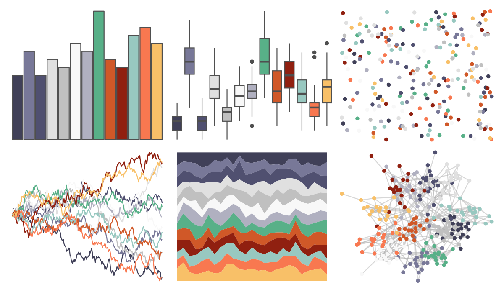
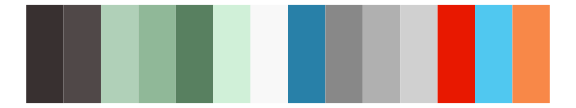

# palettetown - butterfree 

::: columns
::: {.column width="50%"}

**Github**

[timcdlucas/palettetown](https://github.com/timcdlucas/palettetown)
:::

::: {.column width="50%"}

**CRAN**

[palettetown](https://CRAN.R-project.org/package=palettetown)
:::
:::

<hr> 

Use with [paletteer](https://emilhvitfeldt.github.io/paletteer/) package:

```r
library(paletteer)
paletteer_d("palettetown::butterfree")
```

Use raw:

```r
c("#404058FF", "#787898FF", "#505070FF", "#E0E0E0FF", "#C0C0C0FF", "#F8F8F8FF", "#B0B0C0FF", "#58B088FF", "#D05828FF", "#902010FF", "#98C8C0FF", "#F87850FF", "#F8C068FF")
``` 

 

<br>

# Related Palettes

<div class="list" style="display: grid; grid-template-columns: auto auto auto;"> <figure class="figure">
<a href="../../amerika/Dem_Ind_Rep3/"> </a>
</figure> <figure class="figure">
<a href="../../palettetown/nidoqueen/"> </a>
</figure> <figure class="figure">
<a href="../../palettetown/magnemite/"> </a>
</figure> <figure class="figure">
<a href="../../palettetown/marshtomp/"> </a>
</figure> <figure class="figure">
<a href="../../palettetown/magneton/"> </a>
</figure> <figure class="figure">
<a href="../../palettetown/seel/"> </a>
</figure> <figure class="figure">
<a href="../../palettetown/blastoise/"> </a>
</figure> <figure class="figure">
<a href="../../palettetown/latias/"> </a>
</figure> <figure class="figure">
<a href="../../palettetown/tentacool/"> </a>
</figure> <figure class="figure">
<a href="../../palettetown/surskit/"> </a>
</figure> <figure class="figure">
<a href="../../palettetown/mudkip/"> </a>
</figure> <figure class="figure">
<a href="../../palettetown/lapras/"> </a>
</figure> 
</div>
