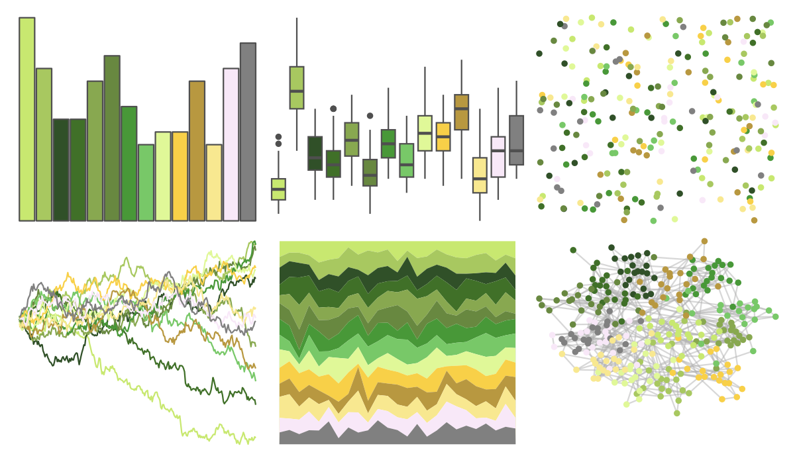

# palettetown - cacnea 

::: columns
::: {.column width="50%"}

**Github**

[timcdlucas/palettetown](https://github.com/timcdlucas/palettetown)
:::

::: {.column width="50%"}

**CRAN**

[palettetown](https://CRAN.R-project.org/package=palettetown)
:::
:::

<hr> 

Use with [paletteer](https://emilhvitfeldt.github.io/paletteer/) package:

```r
library(paletteer)
paletteer_d("palettetown::cacnea")
```

Use raw:

```r
c("#C8E870FF", "#A8C860FF", "#305028FF", "#407028FF", "#88A850FF", "#688840FF", "#489838FF", "#78C868FF", "#E0F898FF", "#F8D048FF", "#B89840FF", "#F8E890FF", "#F8E8F8FF", "#808080FF")
``` 

 

<br>

# Related Palettes

<div class="list" style="display: grid; grid-template-columns: auto auto auto;"> <figure class="figure">
<a href="../../awtools/a_palette/"> </a>
</figure> <figure class="figure">
<a href="../../palettetown/scyther/"> </a>
</figure> <figure class="figure">
<a href="../../palettetown/exeggutor/"> </a>
</figure> <figure class="figure">
<a href="../../palettetown/numel/"> </a>
</figure> <figure class="figure">
<a href="../../palettetown/skiploom/"> </a>
</figure> <figure class="figure">
<a href="../../palettetown/ludicolo/"> </a>
</figure> <figure class="figure">
<a href="../../palettetown/bayleef/"> </a>
</figure> <figure class="figure">
<a href="../../palettetown/caterpie/"> </a>
</figure> <figure class="figure">
<a href="../../tvthemes/Tyrell/"> </a>
</figure> <figure class="figure">
<a href="../../palettetown/politoed/"> </a>
</figure> <figure class="figure">
<a href="../../palettetown/lombre/"> </a>
</figure> <figure class="figure">
<a href="../../palettetown/farfetchd/"> </a>
</figure> 
</div>
