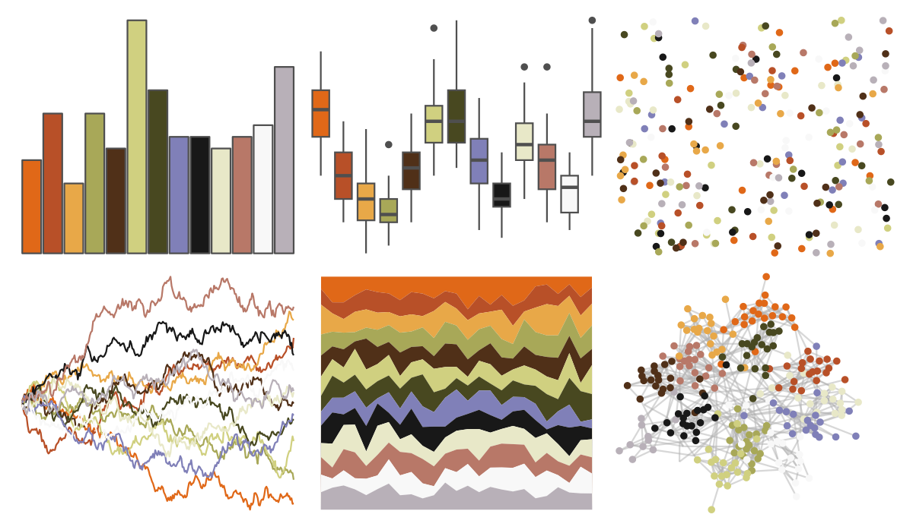

# palettetown - camerupt 

::: columns
::: {.column width="50%"}

**Github**

[timcdlucas/palettetown](https://github.com/timcdlucas/palettetown)
:::

::: {.column width="50%"}

**CRAN**

[palettetown](https://CRAN.R-project.org/package=palettetown)
:::
:::

<hr> 

Use with [paletteer](https://emilhvitfeldt.github.io/paletteer/) package:

```r
library(paletteer)
paletteer_d("palettetown::camerupt")
```

Use raw:

```r
c("#E06818FF", "#B85028FF", "#E8A848FF", "#A8A858FF", "#503018FF", "#D0D080FF", "#484820FF", "#8080B8FF", "#181818FF", "#E8E8C8FF", "#B87868FF", "#F8F8F8FF", "#B8B0B8FF")
``` 

 

<br>

# Related Palettes

<div class="list" style="display: grid; grid-template-columns: auto auto auto;"> <figure class="figure">
<a href="../../amerika/Dem_Ind_Rep3/"> </a>
</figure> <figure class="figure">
<a href="../../palettetown/hariyama/"> </a>
</figure> <figure class="figure">
<a href="../../palettetown/ninjask/"> </a>
</figure> <figure class="figure">
<a href="../../palettetown/feebas/"> </a>
</figure> <figure class="figure">
<a href="../../palettetown/duskull/"> </a>
</figure> <figure class="figure">
<a href="../../palettetown/weedle/"> </a>
</figure> <figure class="figure">
<a href="../../palettetown/beedrill/"> </a>
</figure> <figure class="figure">
<a href="../../palettetown/dodrio/"> </a>
</figure> <figure class="figure">
<a href="../../palettetown/primeape/"> </a>
</figure> <figure class="figure">
<a href="../../palettetown/snorunt/"> </a>
</figure> <figure class="figure">
<a href="../../dutchmasters/pearl_earring/"> </a>
</figure> <figure class="figure">
<a href="../../palettetown/shiftry/"> </a>
</figure> 
</div>
