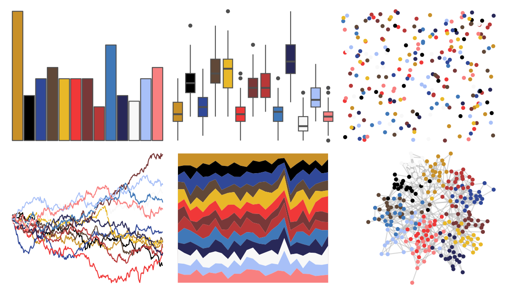

# palettetown - carvanha 

::: columns
::: {.column width="50%"}

**Github**

[timcdlucas/palettetown](https://github.com/timcdlucas/palettetown)
:::

::: {.column width="50%"}

**CRAN**

[palettetown](https://CRAN.R-project.org/package=palettetown)
:::
:::

<hr> 

Use with [paletteer](https://emilhvitfeldt.github.io/paletteer/) package:

```r
library(paletteer)
paletteer_d("palettetown::carvanha")
```

Use raw:

```r
c("#C89028FF", "#000000FF", "#304898FF", "#604838FF", "#E8B828FF", "#F03838FF", "#783838FF", "#B83838FF", "#4078B8FF", "#282858FF", "#F8F8F8FF", "#A8C0F8FF", "#F88080FF")
``` 

 

<br>

# Related Palettes

<div class="list" style="display: grid; grid-template-columns: auto auto auto;"> <figure class="figure">
<a href="../../awtools/a_palette/"> </a>
</figure> <figure class="figure">
<a href="../../ButterflyColors/hamadryas_feronia/"> </a>
</figure> <figure class="figure">
<a href="../../ButterflyColors/hamadryas_feronia/"> </a>
</figure> <figure class="figure">
<a href="../../palettetown/loudred/"> </a>
</figure> <figure class="figure">
<a href="../../palettetown/mightyena/"> </a>
</figure> <figure class="figure">
<a href="../../palettetown/swellow/"> </a>
</figure> <figure class="figure">
<a href="../../palettetown/exploud/"> </a>
</figure> <figure class="figure">
<a href="../../palettetown/taillow/"> </a>
</figure> <figure class="figure">
<a href="../../palettetown/meditite/"> </a>
</figure> <figure class="figure">
<a href="../../palettetown/delcatty/"> </a>
</figure> <figure class="figure">
<a href="../../palettetown/armaldo/"> </a>
</figure> <figure class="figure">
<a href="../../palettetown/chimecho/"> </a>
</figure> 
</div>
