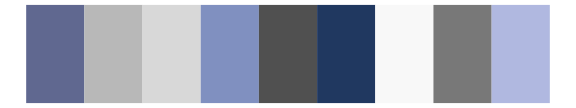

# palettetown - castform 

::: columns
::: {.column width="50%"}

**Github**

[timcdlucas/palettetown](https://github.com/timcdlucas/palettetown)
:::

::: {.column width="50%"}

**CRAN**

[palettetown](https://CRAN.R-project.org/package=palettetown)
:::
:::

<hr> 

Use with [paletteer](https://emilhvitfeldt.github.io/paletteer/) package:

```r
library(paletteer)
paletteer_d("palettetown::castform")
```

Use raw:

```r
c("#C8B8B8FF", "#E0D8D8FF", "#F8F8F8FF", "#585050FF", "#181818FF", "#F0F0E8FF", "#999999FF", "#D8D8F0FF", "#485048FF")
``` 

 

<br>

# Related Palettes

<div class="list" style="display: grid; grid-template-columns: auto auto auto;"> <figure class="figure">
<a href="../../awtools/a_palette/"> </a>
</figure> <figure class="figure">
<a href="../../ggthemr/chalk/"> </a>
</figure> <figure class="figure">
<a href="../../palettetown/silcoon/"> </a>
</figure> <figure class="figure">
<a href="../../RColorBrewer/Greys/"> </a>
</figure> <figure class="figure">
<a href="../../palettetown/poliwrath/"> </a>
</figure> <figure class="figure">
<a href="../../palettetown/aron/"> </a>
</figure> <figure class="figure">
<a href="../../palettetown/linoone/"> </a>
</figure> <figure class="figure">
<a href="../../palettetown/poliwhirl/"> </a>
</figure> <figure class="figure">
<a href="../../palettetown/lairon/"> </a>
</figure> <figure class="figure">
<a href="../../palettetown/aggron/"> </a>
</figure> <figure class="figure">
<a href="../../dutchmasters/little_street/"> </a>
</figure> <figure class="figure">
<a href="../../unikn/pal_unikn_ppt/"> </a>
</figure> 
</div>
