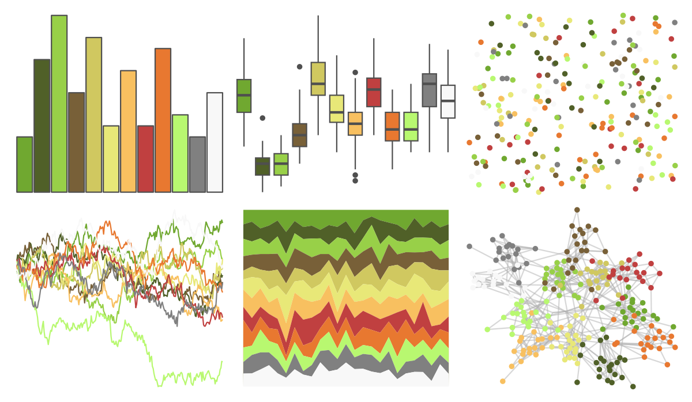

# palettetown - caterpie 

::: columns
::: {.column width="50%"}

**Github**

[timcdlucas/palettetown](https://github.com/timcdlucas/palettetown)
:::

::: {.column width="50%"}

**CRAN**

[palettetown](https://CRAN.R-project.org/package=palettetown)
:::
:::

<hr> 

Use with [paletteer](https://emilhvitfeldt.github.io/paletteer/) package:

```r
library(paletteer)
paletteer_d("palettetown::caterpie")
```

Use raw:

```r
c("#70A830FF", "#506028FF", "#98D048FF", "#786038FF", "#D0C860FF", "#E8E878FF", "#F8C060FF", "#C04040FF", "#E87830FF", "#B8F870FF", "#808080FF", "#F8F8F8FF")
``` 

 

<br>

# Related Palettes

<div class="list" style="display: grid; grid-template-columns: auto auto auto;"> <figure class="figure">
<a href="../../awtools/a_palette/"> </a>
</figure> <figure class="figure">
<a href="../../palettetown/politoed/"> </a>
</figure> <figure class="figure">
<a href="../../palettetown/lombre/"> </a>
</figure> <figure class="figure">
<a href="../../palettetown/sceptile/"> </a>
</figure> <figure class="figure">
<a href="../../palettetown/ludicolo/"> </a>
</figure> <figure class="figure">
<a href="../../palettetown/exeggutor/"> </a>
</figure> <figure class="figure">
<a href="../../palettetown/treecko/"> </a>
</figure> <figure class="figure">
<a href="../../palettetown/seedot/"> </a>
</figure> <figure class="figure">
<a href="../../palettetown/spinarak/"> </a>
</figure> <figure class="figure">
<a href="../../palettetown/skiploom/"> </a>
</figure> <figure class="figure">
<a href="../../palettetown/hoothoot/"> </a>
</figure> <figure class="figure">
<a href="../../palettetown/victreebel/"> </a>
</figure> 
</div>
