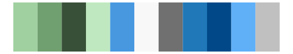
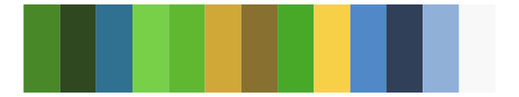
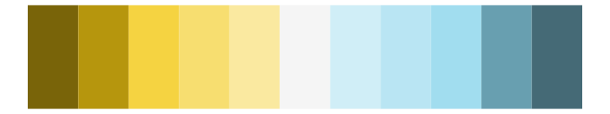
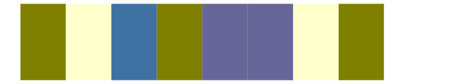
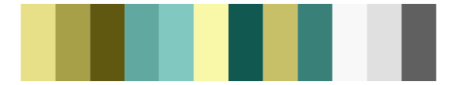
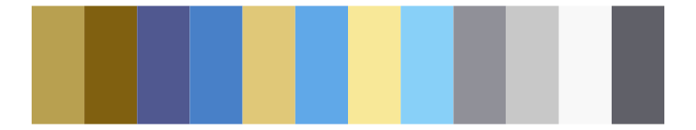
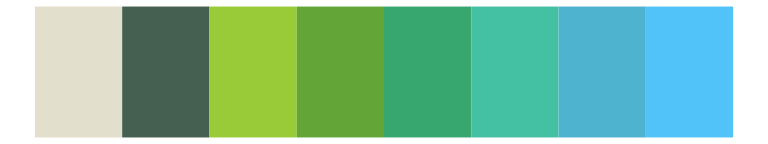
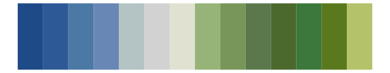

# palettetown - celebi 

::: columns
::: {.column width="50%"}

**Github**

[timcdlucas/palettetown](https://github.com/timcdlucas/palettetown)
:::

::: {.column width="50%"}

**CRAN**

[palettetown](https://CRAN.R-project.org/package=palettetown)
:::
:::

<hr> 

Use with [paletteer](https://emilhvitfeldt.github.io/paletteer/) package:

```r
library(paletteer)
paletteer_d("palettetown::celebi")
```

Use raw:

```r
c("#E8F8D0FF", "#208820FF", "#40B840FF", "#78D070FF", "#F8F8F8FF", "#C0E8A0FF", "#3888C8FF", "#0060B0FF", "#A8E8F8FF", "#70B8E0FF", "#B0B0B8FF")
``` 

 

<br>

# Related Palettes

<div class="list" style="display: grid; grid-template-columns: auto auto auto;"> <figure class="figure">
<a href="../../awtools/a_palette/"> </a>
</figure> <figure class="figure">
<a href="../../ButterflyColors/hamadryas_feronia/"> </a>
</figure> <figure class="figure">
<a href="../../ButterflyColors/hamadryas_feronia/"> </a>
</figure> <figure class="figure">
<a href="../../palettetown/tyranitar/"> </a>
</figure> <figure class="figure">
<a href="../../palettetown/lotad/"> </a>
</figure> <figure class="figure">
<a href="../../Redmonder/dPBIYlBu/"> </a>
</figure> <figure class="figure">
<a href="../../ggprism/ocean3/"> </a>
</figure> <figure class="figure">
<a href="../../palettetown/omanyte/"> </a>
</figure> <figure class="figure">
<a href="../../RColorBrewer/GnBu/"> </a>
</figure> <figure class="figure">
<a href="../../palettetown/hitmontop/"> </a>
</figure> <figure class="figure">
<a href="../../Redmonder/qMSOGnYl/"> </a>
</figure> <figure class="figure">
<a href="../../impressionist.colors/korenveld_onder_onweerslucht/"> </a>
</figure> 
</div>
