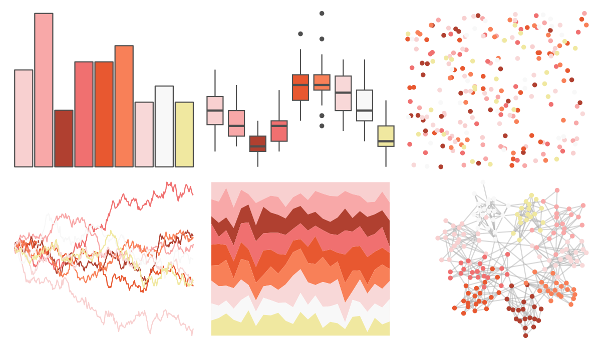
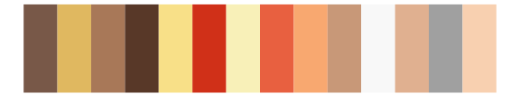

# palettetown - chansey 

::: columns
::: {.column width="50%"}

**Github**

[timcdlucas/palettetown](https://github.com/timcdlucas/palettetown)
:::

::: {.column width="50%"}

**CRAN**

[palettetown](https://CRAN.R-project.org/package=palettetown)
:::
:::

<hr> 

Use with [paletteer](https://emilhvitfeldt.github.io/paletteer/) package:

```r
library(paletteer)
paletteer_d("palettetown::chansey")
```

Use raw:

```r
c("#F8D0D0FF", "#F8A8A8FF", "#B04030FF", "#F07070FF", "#E85830FF", "#F88058FF", "#F8D8D8FF", "#F8F8F8FF", "#F0E8A0FF")
``` 

 

<br>

# Related Palettes

<div class="list" style="display: grid; grid-template-columns: auto auto auto;"> <figure class="figure">
<a href="../../amerika/Dem_Ind_Rep3/"> </a>
</figure> <figure class="figure">
<a href="../../palettetown/pidgey/"> </a>
</figure> <figure class="figure">
<a href="../../palettetown/exeggcute/"> </a>
</figure> <figure class="figure">
<a href="../../palettetown/electabuzz/"> </a>
</figure> <figure class="figure">
<a href="../../palettetown/pidgeot/"> </a>
</figure> <figure class="figure">
<a href="../../palettetown/charmeleon/"> </a>
</figure> <figure class="figure">
<a href="../../soilpalettes/crait/"> </a>
</figure> <figure class="figure">
<a href="../../beyonce/X32/"> </a>
</figure> <figure class="figure">
<a href="../../palettetown/krabby/"> </a>
</figure> <figure class="figure">
<a href="../../palettetown/lickitung/"> </a>
</figure> <figure class="figure">
<a href="../../beyonce/X28/"> </a>
</figure> <figure class="figure">
<a href="../../fishualize/Cantherhines_macrocerus/"> </a>
</figure> 
</div>
