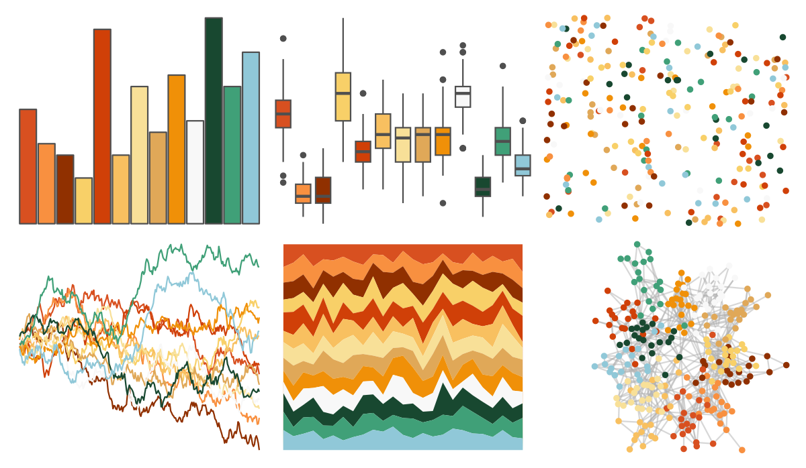

# palettetown - charmander 

::: columns
::: {.column width="50%"}

**Github**

[timcdlucas/palettetown](https://github.com/timcdlucas/palettetown)
:::

::: {.column width="50%"}

**CRAN**

[palettetown](https://CRAN.R-project.org/package=palettetown)
:::
:::

<hr> 

Use with [paletteer](https://emilhvitfeldt.github.io/paletteer/) package:

```r
library(paletteer)
paletteer_d("palettetown::charmander")
```

Use raw:

```r
c("#D85020FF", "#F89040FF", "#903000FF", "#F8D068FF", "#D04008FF", "#F8C060FF", "#F8E098FF", "#E0A858FF", "#F09008FF", "#F8F8F8FF", "#184830FF", "#40A078FF", "#90C8D8FF")
``` 

 

<br>

# Related Palettes

<div class="list" style="display: grid; grid-template-columns: auto auto auto;"> <figure class="figure">
<a href="../../awtools/a_palette/"> </a>
</figure> <figure class="figure">
<a href="../../palettetown/entei/"> </a>
</figure> <figure class="figure">
<a href="../../palettetown/ledyba/"> </a>
</figure> <figure class="figure">
<a href="../../palettetown/squirtle/"> </a>
</figure> <figure class="figure">
<a href="../../palettetown/dugtrio/"> </a>
</figure> <figure class="figure">
<a href="../../palettetown/pidgey/"> </a>
</figure> <figure class="figure">
<a href="../../palettetown/fearow/"> </a>
</figure> <figure class="figure">
<a href="../../palettetown/slowking/"> </a>
</figure> <figure class="figure">
<a href="../../palettetown/persian/"> </a>
</figure> <figure class="figure">
<a href="../../palettetown/pichu/"> </a>
</figure> <figure class="figure">
<a href="../../palettetown/combusken/"> </a>
</figure> <figure class="figure">
<a href="../../palettetown/moltres/"> </a>
</figure> 
</div>
