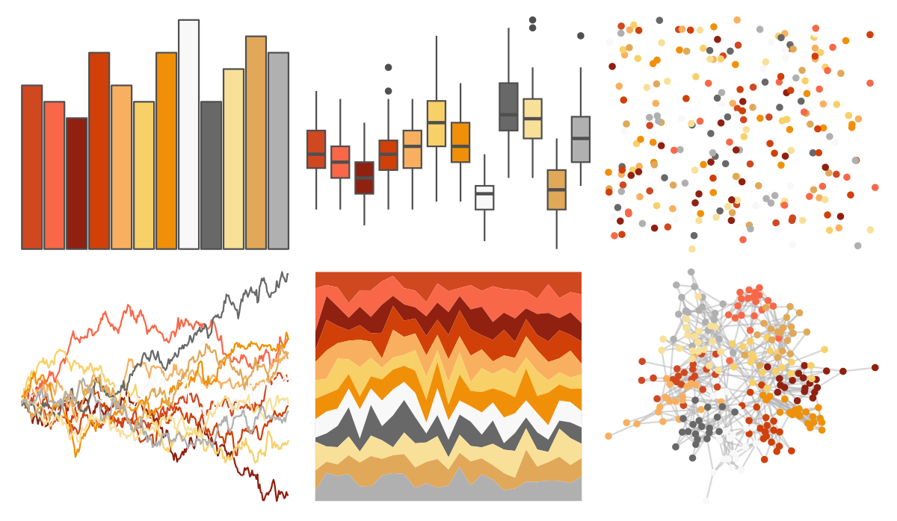

# palettetown - charmeleon 

::: columns
::: {.column width="50%"}

**Github**

[timcdlucas/palettetown](https://github.com/timcdlucas/palettetown)
:::

::: {.column width="50%"}

**CRAN**

[palettetown](https://CRAN.R-project.org/package=palettetown)
:::
:::

<hr> 

Use with [paletteer](https://emilhvitfeldt.github.io/paletteer/) package:

```r
library(paletteer)
paletteer_d("palettetown::charmeleon")
```

Use raw:

```r
c("#D04820FF", "#F86848FF", "#902010FF", "#D04008FF", "#F8B060FF", "#F8D068FF", "#F09008FF", "#F8F8F8FF", "#686868FF", "#F8E098FF", "#E0A858FF", "#B0B0B0FF")
``` 

 

<br>

# Related Palettes

<div class="list" style="display: grid; grid-template-columns: auto auto auto;"> <figure class="figure">
<a href="../../awtools/a_palette/"> </a>
</figure> <figure class="figure">
<a href="../../palettetown/slugma/"> </a>
</figure> <figure class="figure">
<a href="../../palettetown/combusken/"> </a>
</figure> <figure class="figure">
<a href="../../palettetown/pidgey/"> </a>
</figure> <figure class="figure">
<a href="../../palettetown/slowpoke/"> </a>
</figure> <figure class="figure">
<a href="../../palettetown/pidgeot/"> </a>
</figure> <figure class="figure">
<a href="../../palettetown/electabuzz/"> </a>
</figure> <figure class="figure">
<a href="../../palettetown/torchic/"> </a>
</figure> <figure class="figure">
<a href="../../palettetown/octillery/"> </a>
</figure> <figure class="figure">
<a href="../../palettetown/delibird/"> </a>
</figure> <figure class="figure">
<a href="../../palettetown/ledyba/"> </a>
</figure> <figure class="figure">
<a href="../../palettetown/scizor/"> </a>
</figure> 
</div>
