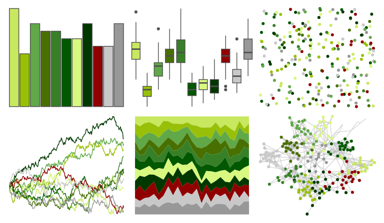

# palettetown - chikorita 

::: columns
::: {.column width="50%"}

**Github**

[timcdlucas/palettetown](https://github.com/timcdlucas/palettetown)
:::

::: {.column width="50%"}

**CRAN**

[palettetown](https://CRAN.R-project.org/package=palettetown)
:::
:::

<hr> 

Use with [paletteer](https://emilhvitfeldt.github.io/paletteer/) package:

```r
library(paletteer)
paletteer_d("palettetown::chikorita")
```

Use raw:

```r
c("#C8E860FF", "#98C008FF", "#60A848FF", "#487000FF", "#388028FF", "#005800FF", "#D8F880FF", "#003800FF", "#900000FF", "#C8C8C8FF", "#989898FF")
``` 

 

<br>

# Related Palettes

<div class="list" style="display: grid; grid-template-columns: auto auto auto;"> <figure class="figure">
<a href="../../awtools/a_palette/"> </a>
</figure> <figure class="figure">
<a href="../../palettetown/bellossom/"> </a>
</figure> <figure class="figure">
<a href="../../palettetown/cacnea/"> </a>
</figure> <figure class="figure">
<a href="../../palettetown/bayleef/"> </a>
</figure> <figure class="figure">
<a href="../../palettetown/gulpin/"> </a>
</figure> <figure class="figure">
<a href="../../palettetown/electrike/"> </a>
</figure> <figure class="figure">
<a href="../../palettetown/venusaur/"> </a>
</figure> <figure class="figure">
<a href="../../palettetown/numel/"> </a>
</figure> <figure class="figure">
<a href="../../palettetown/meganium/"> </a>
</figure> <figure class="figure">
<a href="../../palettetown/smeargle/"> </a>
</figure> <figure class="figure">
<a href="../../ggprism/sunny_garden2/"> </a>
</figure> <figure class="figure">
<a href="../../werpals/arashiyama/"> </a>
</figure> 
</div>
