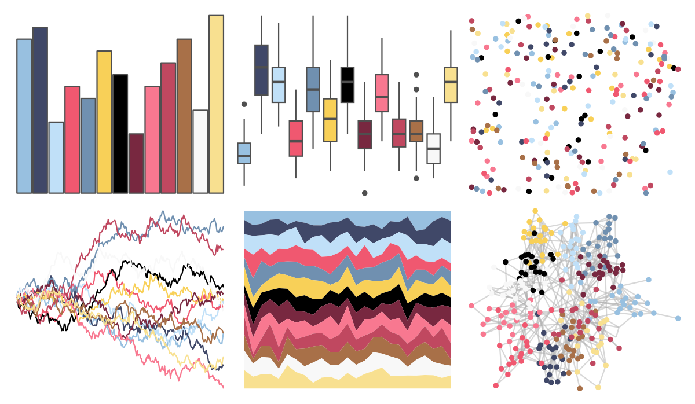
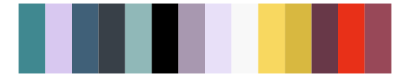

# palettetown - chimecho 

::: columns
::: {.column width="50%"}

**Github**

[timcdlucas/palettetown](https://github.com/timcdlucas/palettetown)
:::

::: {.column width="50%"}

**CRAN**

[palettetown](https://CRAN.R-project.org/package=palettetown)
:::
:::

<hr> 

Use with [paletteer](https://emilhvitfeldt.github.io/paletteer/) package:

```r
library(paletteer)
paletteer_d("palettetown::chimecho")
```

Use raw:

```r
c("#98C0E0FF", "#404868FF", "#C0E0F8FF", "#F05870FF", "#7090B0FF", "#F8D058FF", "#000000FF", "#782840FF", "#F87890FF", "#C04860FF", "#A87048FF", "#F8F8F8FF", "#F8E090FF")
``` 

 

<br>

# Related Palettes

<div class="list" style="display: grid; grid-template-columns: auto auto auto;"> <figure class="figure">
<a href="../../awtools/a_palette/"> </a>
</figure> <figure class="figure">
<a href="../../palettetown/taillow/"> </a>
</figure> <figure class="figure">
<a href="../../palettetown/volbeat/"> </a>
</figure> <figure class="figure">
<a href="../../palettetown/loudred/"> </a>
</figure> <figure class="figure">
<a href="../../palettetown/sharpedo/"> </a>
</figure> <figure class="figure">
<a href="../../palettetown/slaking/"> </a>
</figure> <figure class="figure">
<a href="../../palettetown/exploud/"> </a>
</figure> <figure class="figure">
<a href="../../palettetown/minun/"> </a>
</figure> <figure class="figure">
<a href="../../palettetown/delcatty/"> </a>
</figure> <figure class="figure">
<a href="../../palettetown/miltank/"> </a>
</figure> <figure class="figure">
<a href="../../palettetown/jynx/"> </a>
</figure> <figure class="figure">
<a href="../../palettetown/swalot/"> </a>
</figure> 
</div>
