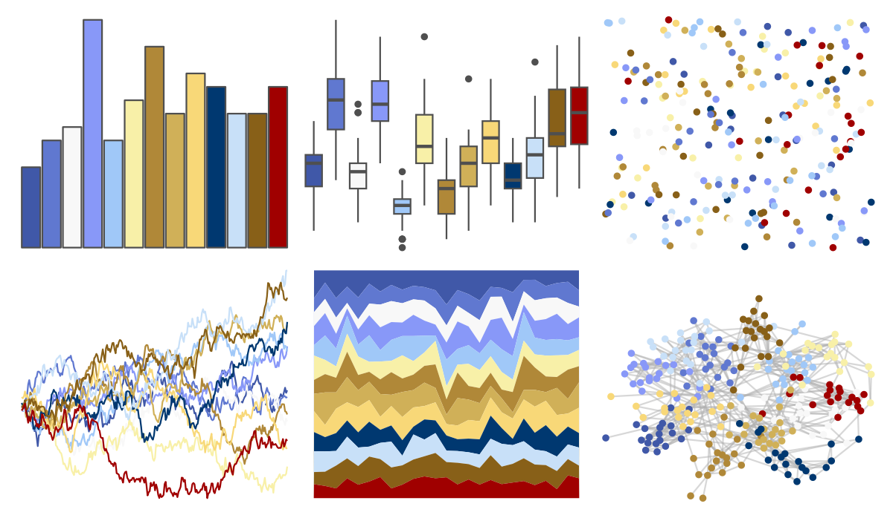
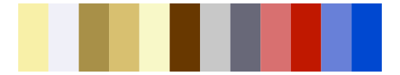

# palettetown - chinchou 

::: columns
::: {.column width="50%"}

**Github**

[timcdlucas/palettetown](https://github.com/timcdlucas/palettetown)
:::

::: {.column width="50%"}

**CRAN**

[palettetown](https://CRAN.R-project.org/package=palettetown)
:::
:::

<hr> 

Use with [paletteer](https://emilhvitfeldt.github.io/paletteer/) package:

```r
library(paletteer)
paletteer_d("palettetown::chinchou")
```

Use raw:

```r
c("#4058A8FF", "#6078D0FF", "#F8F8F8FF", "#8898F8FF", "#A0C8F8FF", "#F8F0A8FF", "#B08838FF", "#D0B058FF", "#F8D878FF", "#003870FF", "#C8E0F8FF", "#886018FF", "#A00000FF")
``` 

 

<br>

# Related Palettes

<div class="list" style="display: grid; grid-template-columns: auto auto auto;"> <figure class="figure">
<a href="../../awtools/a_palette/"> </a>
</figure> <figure class="figure">
<a href="../../palettetown/togepi/"> </a>
</figure> <figure class="figure">
<a href="../../palettetown/qwilfish/"> </a>
</figure> <figure class="figure">
<a href="../../palettetown/golduck/"> </a>
</figure> <figure class="figure">
<a href="../../palettetown/lanturn/"> </a>
</figure> <figure class="figure">
<a href="../../palettetown/feraligatr/"> </a>
</figure> <figure class="figure">
<a href="../../palettetown/machoke/"> </a>
</figure> <figure class="figure">
<a href="../../palettetown/tentacruel/"> </a>
</figure> <figure class="figure">
<a href="../../palettetown/totodile/"> </a>
</figure> <figure class="figure">
<a href="../../palettetown/wartortle/"> </a>
</figure> <figure class="figure">
<a href="../../palettetown/tentacool/"> </a>
</figure> <figure class="figure">
<a href="../../palettetown/mareep/"> </a>
</figure> 
</div>
