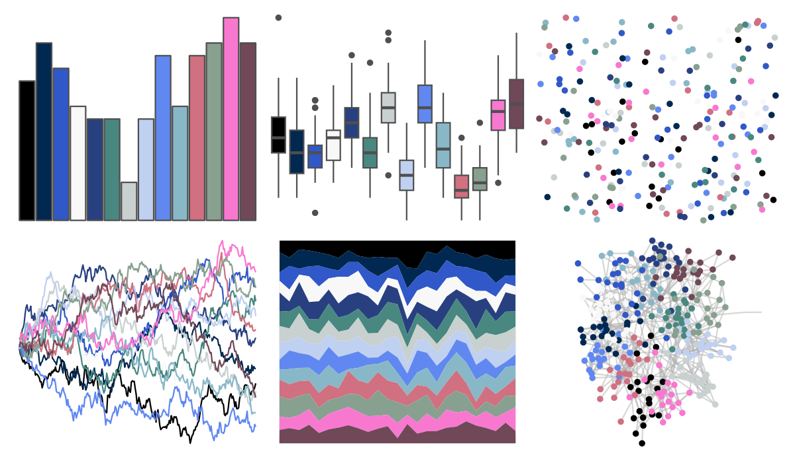
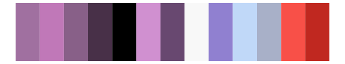

# palettetown - clamperl 

::: columns
::: {.column width="50%"}

**Github**

[timcdlucas/palettetown](https://github.com/timcdlucas/palettetown)
:::

::: {.column width="50%"}

**CRAN**

[palettetown](https://CRAN.R-project.org/package=palettetown)
:::
:::

<hr> 

Use with [paletteer](https://emilhvitfeldt.github.io/paletteer/) package:

```r
library(paletteer)
paletteer_d("palettetown::clamperl")
```

Use raw:

```r
c("#000000FF", "#002850FF", "#3058C8FF", "#F8F8F8FF", "#284080FF", "#488880FF", "#C8D0D0FF", "#C0D0F0FF", "#6088F0FF", "#88B8C8FF", "#D07080FF", "#88A090FF", "#F878D0FF", "#704858FF")
``` 

 

<br>

# Related Palettes

<div class="list" style="display: grid; grid-template-columns: auto auto auto;"> <figure class="figure">
<a href="../../awtools/a_palette/"> </a>
</figure> <figure class="figure">
<a href="../../ButterflyColors/hamadryas_feronia/"> </a>
</figure> <figure class="figure">
<a href="../../ButterflyColors/hamadryas_feronia/"> </a>
</figure> <figure class="figure">
<a href="../../palettetown/golbat/"> </a>
</figure> <figure class="figure">
<a href="../../palettetown/grumpig/"> </a>
</figure> <figure class="figure">
<a href="../../palettetown/illumise/"> </a>
</figure> <figure class="figure">
<a href="../../palettetown/gorebyss/"> </a>
</figure> <figure class="figure">
<a href="../../palettetown/sableye/"> </a>
</figure> <figure class="figure">
<a href="../../palettetown/altaria/"> </a>
</figure> <figure class="figure">
<a href="../../palettetown/zangoose/"> </a>
</figure> <figure class="figure">
<a href="../../palettetown/huntail/"> </a>
</figure> <figure class="figure">
<a href="../../palettetown/gligar/"> </a>
</figure> 
</div>
