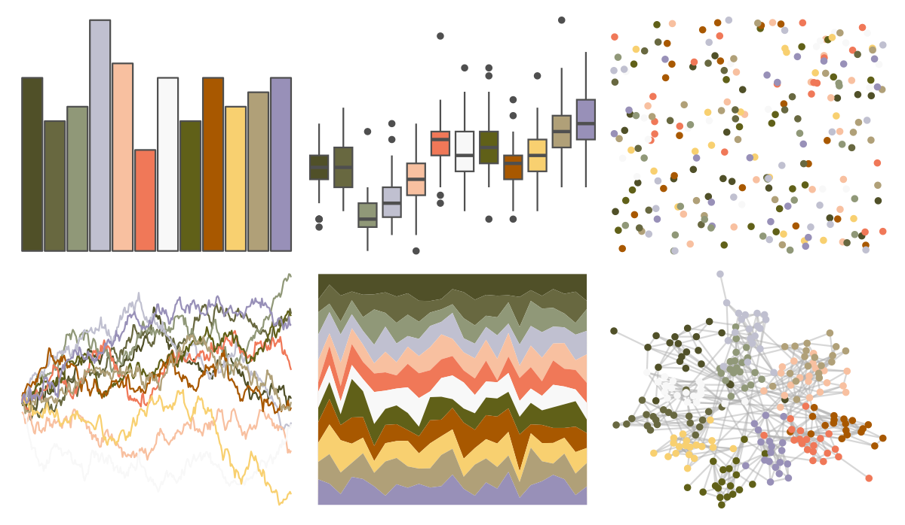

# palettetown - claydol 

::: columns
::: {.column width="50%"}

**Github**

[timcdlucas/palettetown](https://github.com/timcdlucas/palettetown)
:::

::: {.column width="50%"}

**CRAN**

[palettetown](https://CRAN.R-project.org/package=palettetown)
:::
:::

<hr> 

Use with [paletteer](https://emilhvitfeldt.github.io/paletteer/) package:

```r
library(paletteer)
paletteer_d("palettetown::claydol")
```

Use raw:

```r
c("#505028FF", "#686840FF", "#909878FF", "#C0C0D0FF", "#F8C0A0FF", "#F07858FF", "#F8F8F8FF", "#606018FF", "#A85800FF", "#F8D070FF", "#B0A078FF", "#9890B8FF")
``` 

 

<br>

# Related Palettes

<div class="list" style="display: grid; grid-template-columns: auto auto auto;"> <figure class="figure">
<a href="../../awtools/a_palette/"> </a>
</figure> <figure class="figure">
<a href="../../ButterflyColors/hamadryas_feronia/"> </a>
</figure> <figure class="figure">
<a href="../../ButterflyColors/hamadryas_feronia/"> </a>
</figure> <figure class="figure">
<a href="../../palettetown/piloswine/"> </a>
</figure> <figure class="figure">
<a href="../../palettetown/ledyba/"> </a>
</figure> <figure class="figure">
<a href="../../palettetown/ursaring/"> </a>
</figure> <figure class="figure">
<a href="../../palettetown/delibird/"> </a>
</figure> <figure class="figure">
<a href="../../palettetown/kangaskhan/"> </a>
</figure> <figure class="figure">
<a href="../../palettetown/skarmory/"> </a>
</figure> <figure class="figure">
<a href="../../palettetown/noctowl/"> </a>
</figure> <figure class="figure">
<a href="../../palettetown/pichu/"> </a>
</figure> <figure class="figure">
<a href="../../palettetown/girafarig/"> </a>
</figure> 
</div>
