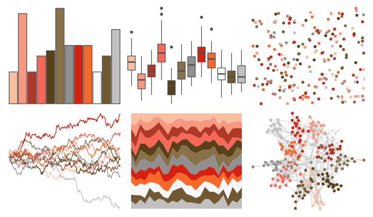

# palettetown - clefable 

::: columns
::: {.column width="50%"}

**Github**

[timcdlucas/palettetown](https://github.com/timcdlucas/palettetown)
:::

::: {.column width="50%"}

**CRAN**

[palettetown](https://CRAN.R-project.org/package=palettetown)
:::
:::

<hr> 

Use with [paletteer](https://emilhvitfeldt.github.io/paletteer/) package:

```r
library(paletteer)
paletteer_d("palettetown::clefable")
```

Use raw:

```r
c("#F8C0A0FF", "#F89880FF", "#B03828FF", "#F86858FF", "#584018FF", "#887048FF", "#909090FF", "#D82010FF", "#F86828FF", "#F8F8F8FF", "#705830FF", "#C0C0C0FF")
``` 

 

<br>

# Related Palettes

<div class="list" style="display: grid; grid-template-columns: auto auto auto;"> <figure class="figure">
<a href="../../awtools/a_palette/"> </a>
</figure> <figure class="figure">
<a href="../../palettetown/clefairy/"> </a>
</figure> <figure class="figure">
<a href="../../palettetown/electrode/"> </a>
</figure> <figure class="figure">
<a href="../../palettetown/voltorb/"> </a>
</figure> <figure class="figure">
<a href="../../palettetown/hitmonchan/"> </a>
</figure> <figure class="figure">
<a href="../../palettetown/dugtrio/"> </a>
</figure> <figure class="figure">
<a href="../../palettetown/cleffa/"> </a>
</figure> <figure class="figure">
<a href="../../peRReo/daddy1/"> </a>
</figure> <figure class="figure">
<a href="../../palettetown/pidgey/"> </a>
</figure> <figure class="figure">
<a href="../../palettetown/charmeleon/"> </a>
</figure> <figure class="figure">
<a href="../../palettetown/seaking/"> </a>
</figure> <figure class="figure">
<a href="../../palettetown/slowpoke/"> </a>
</figure> 
</div>
