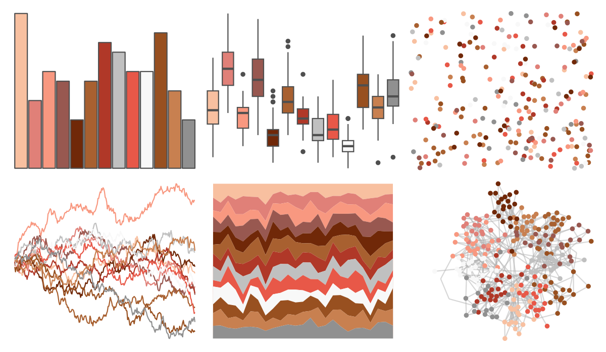
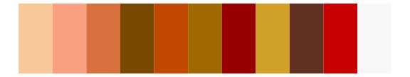

# palettetown - clefairy 

::: columns
::: {.column width="50%"}

**Github**

[timcdlucas/palettetown](https://github.com/timcdlucas/palettetown)
:::

::: {.column width="50%"}

**CRAN**

[palettetown](https://CRAN.R-project.org/package=palettetown)
:::
:::

<hr> 

Use with [paletteer](https://emilhvitfeldt.github.io/paletteer/) package:

```r
library(paletteer)
paletteer_d("palettetown::clefairy")
```

Use raw:

```r
c("#F8C0A0FF", "#E08078FF", "#F89880FF", "#985850FF", "#702808FF", "#A86030FF", "#B03828FF", "#C0C0C0FF", "#E85848FF", "#F8F8F8FF", "#985020FF", "#C88050FF", "#909090FF")
``` 

 

<br>

# Related Palettes

<div class="list" style="display: grid; grid-template-columns: auto auto auto;"> <figure class="figure">
<a href="../../awtools/a_palette/"> </a>
</figure> <figure class="figure">
<a href="../../palettetown/clefable/"> </a>
</figure> <figure class="figure">
<a href="../../palettetown/electrode/"> </a>
</figure> <figure class="figure">
<a href="../../palettetown/voltorb/"> </a>
</figure> <figure class="figure">
<a href="../../palettetown/seaking/"> </a>
</figure> <figure class="figure">
<a href="../../palettetown/hitmonchan/"> </a>
</figure> <figure class="figure">
<a href="../../peRReo/daddy1/"> </a>
</figure> <figure class="figure">
<a href="../../palettetown/groudon/"> </a>
</figure> <figure class="figure">
<a href="../../palettetown/houndoom/"> </a>
</figure> <figure class="figure">
<a href="../../palettetown/cleffa/"> </a>
</figure> <figure class="figure">
<a href="../../Redmonder/qMSOOrRd/"> </a>
</figure> <figure class="figure">
<a href="../../palettetown/slowpoke/"> </a>
</figure> 
</div>
