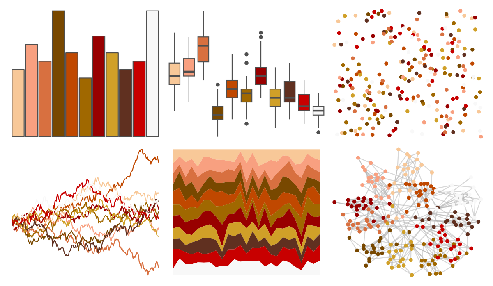

# palettetown - cleffa 

::: columns
::: {.column width="50%"}

**Github**

[timcdlucas/palettetown](https://github.com/timcdlucas/palettetown)
:::

::: {.column width="50%"}

**CRAN**

[palettetown](https://CRAN.R-project.org/package=palettetown)
:::
:::

<hr> 

Use with [paletteer](https://emilhvitfeldt.github.io/paletteer/) package:

```r
library(paletteer)
paletteer_d("palettetown::cleffa")
```

Use raw:

```r
c("#F8C898FF", "#F8A080FF", "#D87040FF", "#784800FF", "#C04800FF", "#A06800FF", "#980000FF", "#D0A028FF", "#603020FF", "#C80000FF", "#F8F8F8FF")
``` 

 

<br>

# Related Palettes

<div class="list" style="display: grid; grid-template-columns: auto auto auto;"> <figure class="figure">
<a href="../../amerika/Dem_Ind_Rep3/"> </a>
</figure> <figure class="figure">
<a href="../../palettetown/clefable/"> </a>
</figure> <figure class="figure">
<a href="../../palettetown/vulpix/"> </a>
</figure> <figure class="figure">
<a href="../../palettetown/dugtrio/"> </a>
</figure> <figure class="figure">
<a href="../../Redmonder/qMSORdOr/"> </a>
</figure> <figure class="figure">
<a href="../../palettetown/fearow/"> </a>
</figure> <figure class="figure">
<a href="../../palettetown/slowpoke/"> </a>
</figure> <figure class="figure">
<a href="../../trekcolors/breen2/"> </a>
</figure> <figure class="figure">
<a href="../../palettetown/clefairy/"> </a>
</figure> <figure class="figure">
<a href="../../palettetown/combusken/"> </a>
</figure> <figure class="figure">
<a href="../../palettetown/parasect/"> </a>
</figure> <figure class="figure">
<a href="../../Redmonder/qMSOYl/"> </a>
</figure> 
</div>
