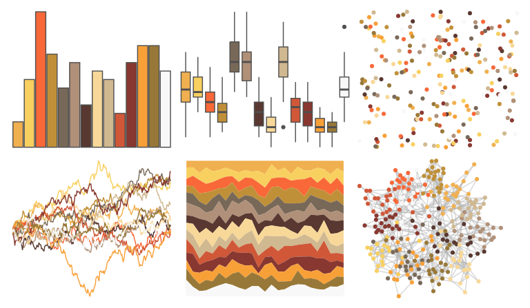

# palettetown - combusken 

::: columns
::: {.column width="50%"}

**Github**

[timcdlucas/palettetown](https://github.com/timcdlucas/palettetown)
:::

::: {.column width="50%"}

**CRAN**

[palettetown](https://CRAN.R-project.org/package=palettetown)
:::
:::

<hr> 

Use with [paletteer](https://emilhvitfeldt.github.io/paletteer/) package:

```r
library(paletteer)
paletteer_d("palettetown::combusken")
```

Use raw:

```r
c("#F0B050FF", "#F8D060FF", "#F86838FF", "#C09038FF", "#786858FF", "#B09078FF", "#583830FF", "#F8D898FF", "#D0B890FF", "#D05838FF", "#883830FF", "#F8A038FF", "#987838FF", "#F8F8F8FF")
``` 

 

<br>

# Related Palettes

<div class="list" style="display: grid; grid-template-columns: auto auto auto;"> <figure class="figure">
<a href="../../awtools/a_palette/"> </a>
</figure> <figure class="figure">
<a href="../../palettetown/charmeleon/"> </a>
</figure> <figure class="figure">
<a href="../../palettetown/torchic/"> </a>
</figure> <figure class="figure">
<a href="../../palettetown/marowak/"> </a>
</figure> <figure class="figure">
<a href="../../palettetown/ledyba/"> </a>
</figure> <figure class="figure">
<a href="../../palettetown/pidgeot/"> </a>
</figure> <figure class="figure">
<a href="../../palettetown/slowking/"> </a>
</figure> <figure class="figure">
<a href="../../palettetown/slowpoke/"> </a>
</figure> <figure class="figure">
<a href="../../palettetown/pidgey/"> </a>
</figure> <figure class="figure">
<a href="../../palettetown/fearow/"> </a>
</figure> <figure class="figure">
<a href="../../palettetown/entei/"> </a>
</figure> <figure class="figure">
<a href="../../palettetown/delibird/"> </a>
</figure> 
</div>
