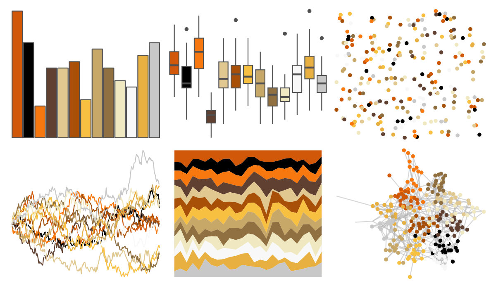

# palettetown - corphish 

::: columns
::: {.column width="50%"}

**Github**

[timcdlucas/palettetown](https://github.com/timcdlucas/palettetown)
:::

::: {.column width="50%"}

**CRAN**

[palettetown](https://CRAN.R-project.org/package=palettetown)
:::
:::

<hr> 

Use with [paletteer](https://emilhvitfeldt.github.io/paletteer/) package:

```r
library(paletteer)
paletteer_d("palettetown::corphish")
```

Use raw:

```r
c("#D05808FF", "#000000FF", "#F87810FF", "#604030FF", "#E0C890FF", "#A85008FF", "#F8C040FF", "#C8A868FF", "#907040FF", "#F0E8C0FF", "#F8F8F8FF", "#E8B040FF", "#C8C8C8FF")
``` 

 

<br>

# Related Palettes

<div class="list" style="display: grid; grid-template-columns: auto auto auto;"> <figure class="figure">
<a href="../../amerika/Dem_Ind_Rep3/"> </a>
</figure> <figure class="figure">
<a href="../../palettetown/primeape/"> </a>
</figure> <figure class="figure">
<a href="../../palettetown/spearow/"> </a>
</figure> <figure class="figure">
<a href="../../palettetown/regirock/"> </a>
</figure> <figure class="figure">
<a href="../../palettetown/pidgeotto/"> </a>
</figure> <figure class="figure">
<a href="../../palettetown/plusle/"> </a>
</figure> <figure class="figure">
<a href="../../palettetown/cubone/"> </a>
</figure> <figure class="figure">
<a href="../../palettetown/weedle/"> </a>
</figure> <figure class="figure">
<a href="../../palettetown/medicham/"> </a>
</figure> <figure class="figure">
<a href="../../palettetown/magmar/"> </a>
</figure> <figure class="figure">
<a href="../../palettetown/entei/"> </a>
</figure> <figure class="figure">
<a href="../../palettetown/arcanine/"> </a>
</figure> 
</div>
