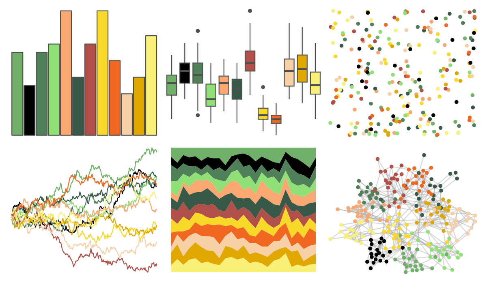

# palettetown - cradily 

::: columns
::: {.column width="50%"}

**Github**

[timcdlucas/palettetown](https://github.com/timcdlucas/palettetown)
:::

::: {.column width="50%"}

**CRAN**

[palettetown](https://CRAN.R-project.org/package=palettetown)
:::
:::

<hr> 

Use with [paletteer](https://emilhvitfeldt.github.io/paletteer/) package:

```r
library(paletteer)
paletteer_d("palettetown::cradily")
```

Use raw:

```r
c("#70B068FF", "#000000FF", "#508058FF", "#90E078FF", "#F8A870FF", "#385848FF", "#B05048FF", "#F8D828FF", "#F06820FF", "#F8D0A8FF", "#E0A800FF", "#F8F078FF")
``` 

 

<br>

# Related Palettes

<div class="list" style="display: grid; grid-template-columns: auto auto auto;"> <figure class="figure">
<a href="../../amerika/Dem_Ind_Rep3/"> </a>
</figure> <figure class="figure">
<a href="../../palettetown/kecleon/"> </a>
</figure> <figure class="figure">
<a href="../../palettetown/trapinch/"> </a>
</figure> <figure class="figure">
<a href="../../palettetown/breloom/"> </a>
</figure> <figure class="figure">
<a href="../../palettetown/natu/"> </a>
</figure> <figure class="figure">
<a href="../../palettetown/rayquaza/"> </a>
</figure> <figure class="figure">
<a href="../../palettetown/treecko/"> </a>
</figure> <figure class="figure">
<a href="../../palettetown/wurmple/"> </a>
</figure> <figure class="figure">
<a href="../../palettetown/meganium/"> </a>
</figure> <figure class="figure">
<a href="../../palettetown/smeargle/"> </a>
</figure> <figure class="figure">
<a href="../../palettetown/tropius/"> </a>
</figure> <figure class="figure">
<a href="../../impressionist.colors/la_sieste/"> </a>
</figure> 
</div>
