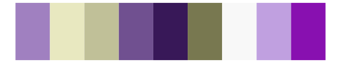

# palettetown - crobat 

::: columns
::: {.column width="50%"}

**Github**

[timcdlucas/palettetown](https://github.com/timcdlucas/palettetown)
:::

::: {.column width="50%"}

**CRAN**

[palettetown](https://CRAN.R-project.org/package=palettetown)
:::
:::

<hr> 

Use with [paletteer](https://emilhvitfeldt.github.io/paletteer/) package:

```r
library(paletteer)
paletteer_d("palettetown::crobat")
```

Use raw:

```r
c("#C058C8FF", "#9838B0FF", "#701890FF", "#E088F0FF", "#F8F8F8FF", "#F8D000FF", "#A0A0A0FF", "#D09000FF", "#686868FF")
``` 

 

<br>

# Related Palettes

<div class="list" style="display: grid; grid-template-columns: auto auto auto;"> <figure class="figure">
<a href="../../awtools/a_palette/"> </a>
</figure> <figure class="figure">
<a href="../../palettetown/granbull/"> </a>
</figure> <figure class="figure">
<a href="../../yarrr/pony/"> </a>
</figure> <figure class="figure">
<a href="../../palettetown/raikou/"> </a>
</figure> <figure class="figure">
<a href="../../palettetown/dratini/"> </a>
</figure> <figure class="figure">
<a href="../../futurevisions/kepler16b/"> </a>
</figure> <figure class="figure">
<a href="../../palettetown/aipom/"> </a>
</figure> <figure class="figure">
<a href="../../unikn/pal_unikn_pref/"> </a>
</figure> <figure class="figure">
<a href="../../werpals/provence/"> </a>
</figure> <figure class="figure">
<a href="../../palettetown/illumise/"> </a>
</figure> <figure class="figure">
<a href="../../ggthemr/lilac/"> </a>
</figure> <figure class="figure">
<a href="../../palettetown/arbok/"> </a>
</figure> 
</div>
