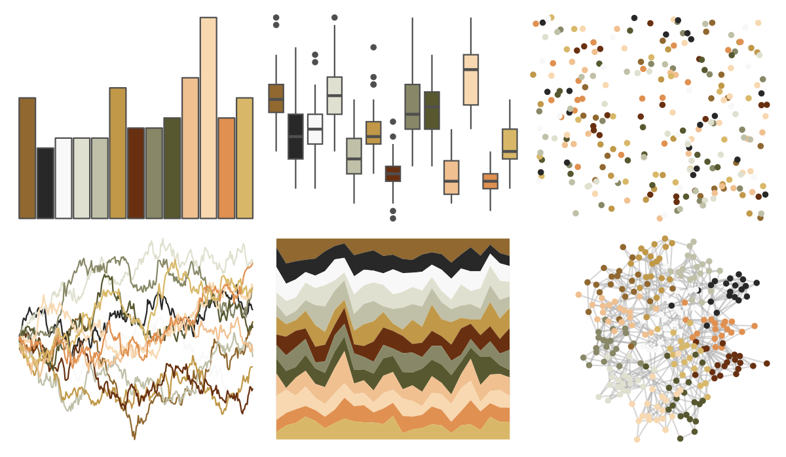
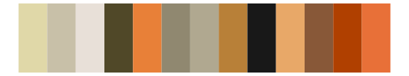

# palettetown - cubone 

::: columns
::: {.column width="50%"}

**Github**

[timcdlucas/palettetown](https://github.com/timcdlucas/palettetown)
:::

::: {.column width="50%"}

**CRAN**

[palettetown](https://CRAN.R-project.org/package=palettetown)
:::
:::

<hr> 

Use with [paletteer](https://emilhvitfeldt.github.io/paletteer/) package:

```r
library(paletteer)
paletteer_d("palettetown::cubone")
```

Use raw:

```r
c("#906830FF", "#282828FF", "#F8F8F8FF", "#E0E0D0FF", "#C0C0A8FF", "#C09848FF", "#683010FF", "#888868FF", "#585830FF", "#F0C090FF", "#F8D8B0FF", "#E09050FF", "#D8B868FF")
``` 

 

<br>

# Related Palettes

<div class="list" style="display: grid; grid-template-columns: auto auto auto;"> <figure class="figure">
<a href="../../awtools/a_palette/"> </a>
</figure> <figure class="figure">
<a href="../../palettetown/piloswine/"> </a>
</figure> <figure class="figure">
<a href="../../palettetown/marowak/"> </a>
</figure> <figure class="figure">
<a href="../../palettetown/noctowl/"> </a>
</figure> <figure class="figure">
<a href="../../palettetown/hitmonlee/"> </a>
</figure> <figure class="figure">
<a href="../../palettetown/squirtle/"> </a>
</figure> <figure class="figure">
<a href="../../palettetown/regirock/"> </a>
</figure> <figure class="figure">
<a href="../../palettetown/growlithe/"> </a>
</figure> <figure class="figure">
<a href="../../palettetown/corphish/"> </a>
</figure> <figure class="figure">
<a href="../../palettetown/combusken/"> </a>
</figure> <figure class="figure">
<a href="../../palettetown/ursaring/"> </a>
</figure> <figure class="figure">
<a href="../../palettetown/torchic/"> </a>
</figure> 
</div>
