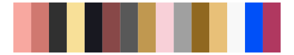

# palettetown - delcatty 

::: columns
::: {.column width="50%"}

**Github**

[timcdlucas/palettetown](https://github.com/timcdlucas/palettetown)
:::

::: {.column width="50%"}

**CRAN**

[palettetown](https://CRAN.R-project.org/package=palettetown)
:::
:::

<hr> 

Use with [paletteer](https://emilhvitfeldt.github.io/paletteer/) package:

```r
library(paletteer)
paletteer_d("palettetown::delcatty")
```

Use raw:

```r
c("#D890A0FF", "#000000FF", "#F8B840FF", "#704850FF", "#A05868FF", "#803848FF", "#F8D860FF", "#C07888FF", "#D89840FF", "#B88058FF", "#F0B0C0FF", "#F8F898FF", "#482878FF", "#F8F8F8FF", "#684898FF")
``` 

 

<br>

# Related Palettes

<div class="list" style="display: grid; grid-template-columns: auto auto auto;"> <figure class="figure">
<a href="../../awtools/a_palette/"> </a>
</figure> <figure class="figure">
<a href="../../palettetown/exploud/"> </a>
</figure> <figure class="figure">
<a href="../../palettetown/loudred/"> </a>
</figure> <figure class="figure">
<a href="../../palettetown/swellow/"> </a>
</figure> <figure class="figure">
<a href="../../palettetown/taillow/"> </a>
</figure> <figure class="figure">
<a href="../../palettetown/volbeat/"> </a>
</figure> <figure class="figure">
<a href="../../palettetown/jynx/"> </a>
</figure> <figure class="figure">
<a href="../../palettetown/miltank/"> </a>
</figure> <figure class="figure">
<a href="../../palettetown/poochyena/"> </a>
</figure> <figure class="figure">
<a href="../../palettetown/chimecho/"> </a>
</figure> <figure class="figure">
<a href="../../palettetown/gyarados/"> </a>
</figure> <figure class="figure">
<a href="../../palettetown/slaking/"> </a>
</figure> 
</div>
