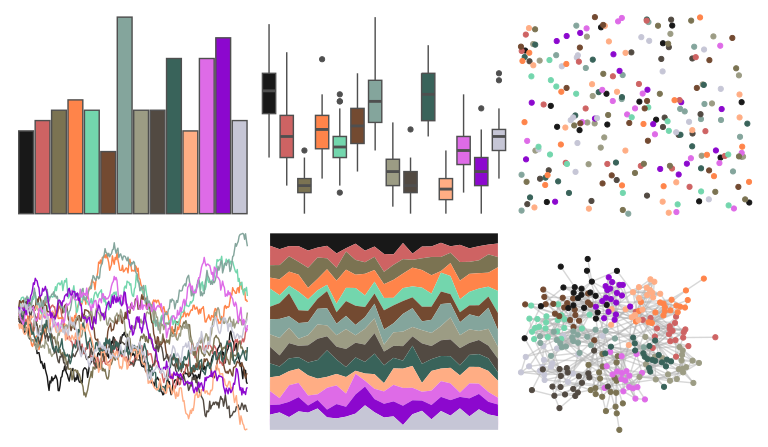

# palettetown - deoxys 

::: columns
::: {.column width="50%"}

**Github**

[timcdlucas/palettetown](https://github.com/timcdlucas/palettetown)
:::

::: {.column width="50%"}

**CRAN**

[palettetown](https://CRAN.R-project.org/package=palettetown)
:::
:::

<hr> 

Use with [paletteer](https://emilhvitfeldt.github.io/paletteer/) package:

```r
library(paletteer)
paletteer_d("palettetown::deoxys")
```

Use raw:

```r
c("#181818FF", "#CE6363FF", "#7B7352FF", "#FF844AFF", "#73D6ADFF", "#734A31FF", "#84A59CFF", "#9C9C84FF", "#524A42FF", "#39635AFF", "#FFAD84FF", "#DE6BE7FF", "#8C08CEFF", "#C6C6D6FF")
``` 

 

<br>

# Related Palettes

<div class="list" style="display: grid; grid-template-columns: auto auto auto;"> <figure class="figure">
<a href="../../awtools/a_palette/"> </a>
</figure> <figure class="figure">
<a href="../../rcartocolor/Vivid/"> </a>
</figure> <figure class="figure">
<a href="../../palettetown/venonat/"> </a>
</figure> <figure class="figure">
<a href="../../palettetown/nosepass/"> </a>
</figure> <figure class="figure">
<a href="../../palettetown/nidorino/"> </a>
</figure> <figure class="figure">
<a href="../../rcartocolor/Bold/"> </a>
</figure> <figure class="figure">
<a href="../../ggsci/hallmarks_light_cosmic/"> </a>
</figure> <figure class="figure">
<a href="../../palettetown/huntail/"> </a>
</figure> <figure class="figure">
<a href="../../palettetown/raikou/"> </a>
</figure> <figure class="figure">
<a href="../../yarrr/info2/"> </a>
</figure> <figure class="figure">
<a href="../../palettetown/nidoranm/"> </a>
</figure> <figure class="figure">
<a href="../../palettetown/gloom/"> </a>
</figure> 
</div>
