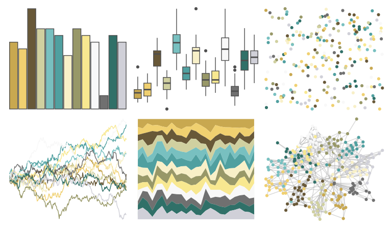

# palettetown - dragonite 

::: columns
::: {.column width="50%"}

**Github**

[timcdlucas/palettetown](https://github.com/timcdlucas/palettetown)
:::

::: {.column width="50%"}

**CRAN**

[palettetown](https://CRAN.R-project.org/package=palettetown)
:::
:::

<hr> 

Use with [paletteer](https://emilhvitfeldt.github.io/paletteer/) package:

```r
library(paletteer)
paletteer_d("palettetown::dragonite")
```

Use raw:

```r
c("#C8A850FF", "#F0D070FF", "#685838FF", "#D0D0A0FF", "#78C0C0FF", "#50A0A0FF", "#F8F0C8FF", "#989868FF", "#F8E890FF", "#F8F8F8FF", "#707070FF", "#307068FF", "#D0D0D8FF")
``` 

 

<br>

# Related Palettes

<div class="list" style="display: grid; grid-template-columns: auto auto auto;"> <figure class="figure">
<a href="../../awtools/a_palette/"> </a>
</figure> <figure class="figure">
<a href="../../palettetown/omanyte/"> </a>
</figure> <figure class="figure">
<a href="../../palettetown/sandshrew/"> </a>
</figure> <figure class="figure">
<a href="../../palettetown/hypno/"> </a>
</figure> <figure class="figure">
<a href="../../palettetown/kabutops/"> </a>
</figure> <figure class="figure">
<a href="../../palettetown/teddiursa/"> </a>
</figure> <figure class="figure">
<a href="../../palettetown/stantler/"> </a>
</figure> <figure class="figure">
<a href="../../palettetown/dunsparce/"> </a>
</figure> <figure class="figure">
<a href="../../palettetown/seedot/"> </a>
</figure> <figure class="figure">
<a href="../../palettetown/omastar/"> </a>
</figure> <figure class="figure">
<a href="../../palettetown/golem/"> </a>
</figure> <figure class="figure">
<a href="../../palettetown/snorlax/"> </a>
</figure> 
</div>
