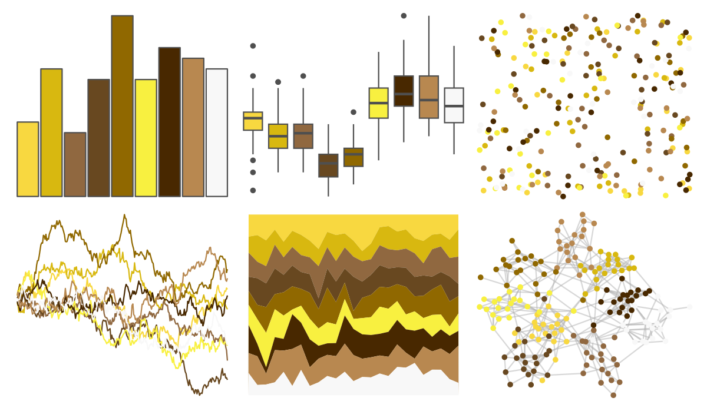

# palettetown - drowzee 

::: columns
::: {.column width="50%"}

**Github**

[timcdlucas/palettetown](https://github.com/timcdlucas/palettetown)
:::

::: {.column width="50%"}

**CRAN**

[palettetown](https://CRAN.R-project.org/package=palettetown)
:::
:::

<hr> 

Use with [paletteer](https://emilhvitfeldt.github.io/paletteer/) package:

```r
library(paletteer)
paletteer_d("palettetown::drowzee")
```

Use raw:

```r
c("#F8D840FF", "#D8B810FF", "#906840FF", "#684820FF", "#906800FF", "#F8F040FF", "#482800FF", "#B88850FF", "#F8F8F8FF")
``` 

 

<br>

# Related Palettes

<div class="list" style="display: grid; grid-template-columns: auto auto auto;"> <figure class="figure">
<a href="../../awtools/a_palette/"> </a>
</figure> <figure class="figure">
<a href="../../NatParksPalettes/Olympic/"> </a>
</figure> <figure class="figure">
<a href="../../palettetown/persian/"> </a>
</figure> <figure class="figure">
<a href="../../palettetown/bellsprout/"> </a>
</figure> <figure class="figure">
<a href="../../palettetown/kabuto/"> </a>
</figure> <figure class="figure">
<a href="../../palettetown/weepinbell/"> </a>
</figure> <figure class="figure">
<a href="../../tvthemes/parksAndRec/"> </a>
</figure> <figure class="figure">
<a href="../../palettetown/meowth/"> </a>
</figure> <figure class="figure">
<a href="../../palettetown/shedinja/"> </a>
</figure> <figure class="figure">
<a href="../../palettetown/girafarig/"> </a>
</figure> <figure class="figure">
<a href="../../palettetown/alakazam/"> </a>
</figure> <figure class="figure">
<a href="../../palettetown/golem/"> </a>
</figure> 
</div>
