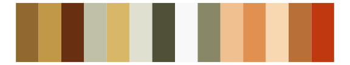

# palettetown - dugtrio 

::: columns
::: {.column width="50%"}

**Github**

[timcdlucas/palettetown](https://github.com/timcdlucas/palettetown)
:::

::: {.column width="50%"}

**CRAN**

[palettetown](https://CRAN.R-project.org/package=palettetown)
:::
:::

<hr> 

Use with [paletteer](https://emilhvitfeldt.github.io/paletteer/) package:

```r
library(paletteer)
paletteer_d("palettetown::dugtrio")
```

Use raw:

```r
c("#C07840FF", "#A05820FF", "#682000FF", "#B0A870FF", "#E0A060FF", "#E0E0B0FF", "#585020FF", "#807848FF", "#F86858FF", "#F04030FF", "#F8C8C0FF", "#F8F8F8FF")
``` 

 

<br>

# Related Palettes

<div class="list" style="display: grid; grid-template-columns: auto auto auto;"> <figure class="figure">
<a href="../../awtools/a_palette/"> </a>
</figure> <figure class="figure">
<a href="../../palettetown/fearow/"> </a>
</figure> <figure class="figure">
<a href="../../palettetown/pidgey/"> </a>
</figure> <figure class="figure">
<a href="../../palettetown/pidgeot/"> </a>
</figure> <figure class="figure">
<a href="../../palettetown/lickitung/"> </a>
</figure> <figure class="figure">
<a href="../../palettetown/krabby/"> </a>
</figure> <figure class="figure">
<a href="../../palettetown/marowak/"> </a>
</figure> <figure class="figure">
<a href="../../palettetown/slowking/"> </a>
</figure> <figure class="figure">
<a href="../../palettetown/charmander/"> </a>
</figure> <figure class="figure">
<a href="../../palettetown/spearow/"> </a>
</figure> <figure class="figure">
<a href="../../palettetown/persian/"> </a>
</figure> <figure class="figure">
<a href="../../palettetown/combusken/"> </a>
</figure> 
</div>
