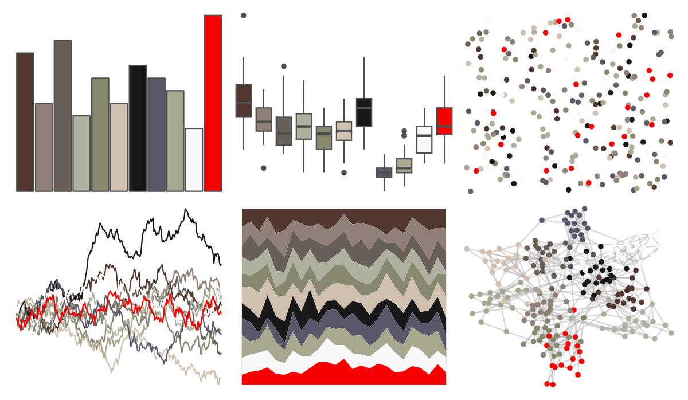
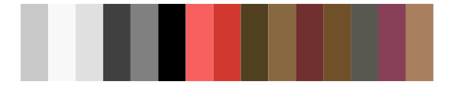

# palettetown - dusclops 

::: columns
::: {.column width="50%"}

**Github**

[timcdlucas/palettetown](https://github.com/timcdlucas/palettetown)
:::

::: {.column width="50%"}

**CRAN**

[palettetown](https://CRAN.R-project.org/package=palettetown)
:::
:::

<hr> 

Use with [paletteer](https://emilhvitfeldt.github.io/paletteer/) package:

```r
library(paletteer)
paletteer_d("palettetown::dusclops")
```

Use raw:

```r
c("#503830FF", "#908078FF", "#686058FF", "#B0B0A0FF", "#888870FF", "#D0C0B0FF", "#181818FF", "#585868FF", "#A8A890FF", "#F8F8F8FF", "#F80000FF")
``` 

 

<br>

# Related Palettes

<div class="list" style="display: grid; grid-template-columns: auto auto auto;"> <figure class="figure">
<a href="../../awtools/a_palette/"> </a>
</figure> <figure class="figure">
<a href="../../palettetown/slakoth/"> </a>
</figure> <figure class="figure">
<a href="../../palettetown/anorith/"> </a>
</figure> <figure class="figure">
<a href="../../palettetown/houndour/"> </a>
</figure> <figure class="figure">
<a href="../../RColorBrewer/RdGy/"> </a>
</figure> <figure class="figure">
<a href="../../palettetown/duskull/"> </a>
</figure> <figure class="figure">
<a href="../../palettetown/torkoal/"> </a>
</figure> <figure class="figure">
<a href="../../palettetown/vigoroth/"> </a>
</figure> <figure class="figure">
<a href="../../palettetown/poochyena/"> </a>
</figure> <figure class="figure">
<a href="../../palettetown/houndoom/"> </a>
</figure> <figure class="figure">
<a href="../../palettetown/armaldo/"> </a>
</figure> <figure class="figure">
<a href="../../palettetown/relicanth/"> </a>
</figure> 
</div>
