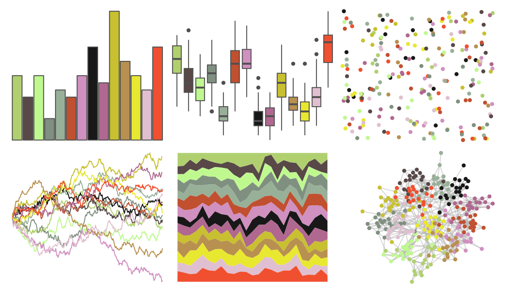

# palettetown - dustox 

::: columns
::: {.column width="50%"}

**Github**

[timcdlucas/palettetown](https://github.com/timcdlucas/palettetown)
:::

::: {.column width="50%"}

**CRAN**

[palettetown](https://CRAN.R-project.org/package=palettetown)
:::
:::

<hr> 

Use with [paletteer](https://emilhvitfeldt.github.io/paletteer/) package:

```r
library(paletteer)
paletteer_d("palettetown::dustox")
```

Use raw:

```r
c("#B0D070FF", "#584848FF", "#C0F890FF", "#809080FF", "#98B098FF", "#C05030FF", "#D090C0FF", "#181818FF", "#B06890FF", "#C8C030FF", "#B89050FF", "#E8E830FF", "#E0C0D0FF", "#F05030FF")
``` 

 

<br>

# Related Palettes

<div class="list" style="display: grid; grid-template-columns: auto auto auto;"> <figure class="figure">
<a href="../../awtools/a_palette/"> </a>
</figure> <figure class="figure">
<a href="../../ButterflyColors/hamadryas_feronia/"> </a>
</figure> <figure class="figure">
<a href="../../ButterflyColors/hamadryas_feronia/"> </a>
</figure> <figure class="figure">
<a href="../../impressionist.colors/la_sieste/"> </a>
</figure> <figure class="figure">
<a href="../../palettetown/camerupt/"> </a>
</figure> <figure class="figure">
<a href="../../palettetown/murkrow/"> </a>
</figure> <figure class="figure">
<a href="../../palettetown/machoke/"> </a>
</figure> <figure class="figure">
<a href="../../palettetown/natu/"> </a>
</figure> <figure class="figure">
<a href="../../palettetown/wurmple/"> </a>
</figure> <figure class="figure">
<a href="../../palettetown/koffing/"> </a>
</figure> <figure class="figure">
<a href="../../palettetown/xatu/"> </a>
</figure> <figure class="figure">
<a href="../../palettetown/shiftry/"> </a>
</figure> 
</div>
