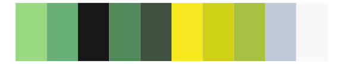
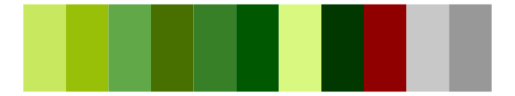

# palettetown - electrike 

::: columns
::: {.column width="50%"}

**Github**

[timcdlucas/palettetown](https://github.com/timcdlucas/palettetown)
:::

::: {.column width="50%"}

**CRAN**

[palettetown](https://CRAN.R-project.org/package=palettetown)
:::
:::

<hr> 

Use with [paletteer](https://emilhvitfeldt.github.io/paletteer/) package:

```r
library(paletteer)
paletteer_d("palettetown::electrike")
```

Use raw:

```r
c("#98D880FF", "#68B078FF", "#181818FF", "#508858FF", "#405040FF", "#F8E820FF", "#D0D018FF", "#A8C040FF", "#C0C8D8FF", "#F8F8F8FF")
``` 

 

<br>

# Related Palettes

<div class="list" style="display: grid; grid-template-columns: auto auto auto;"> <figure class="figure">
<a href="../../awtools/a_palette/"> </a>
</figure> <figure class="figure">
<a href="../../palettetown/gulpin/"> </a>
</figure> <figure class="figure">
<a href="../../palettetown/numel/"> </a>
</figure> <figure class="figure">
<a href="../../palettetown/cacnea/"> </a>
</figure> <figure class="figure">
<a href="../../palettetown/jolteon/"> </a>
</figure> <figure class="figure">
<a href="../../palettetown/lotad/"> </a>
</figure> <figure class="figure">
<a href="../../impressionist.colors/melon_et_peches/"> </a>
</figure> <figure class="figure">
<a href="../../palettetown/vibrava/"> </a>
</figure> <figure class="figure">
<a href="../../palettetown/chikorita/"> </a>
</figure> <figure class="figure">
<a href="../../palettetown/omanyte/"> </a>
</figure> <figure class="figure">
<a href="../../fishualize/Prognathodes_guyanensis/"> </a>
</figure> <figure class="figure">
<a href="../../palettetown/sandslash/"> </a>
</figure> 
</div>
