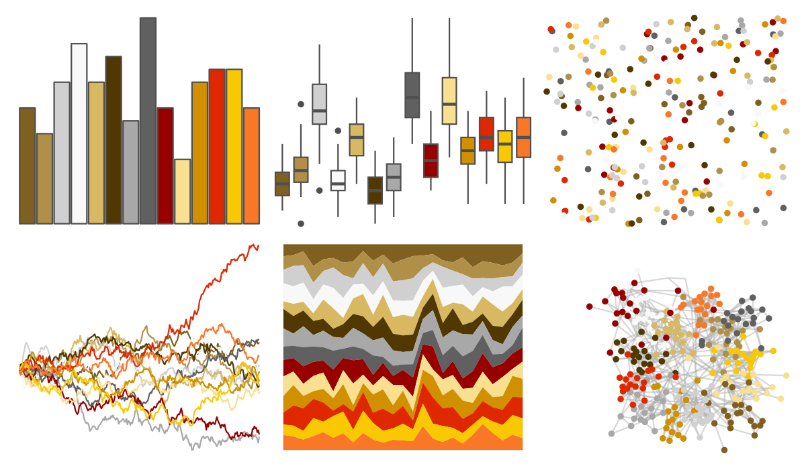

# palettetown - entei 

::: columns
::: {.column width="50%"}

**Github**

[timcdlucas/palettetown](https://github.com/timcdlucas/palettetown)
:::

::: {.column width="50%"}

**CRAN**

[palettetown](https://CRAN.R-project.org/package=palettetown)
:::
:::

<hr> 

Use with [paletteer](https://emilhvitfeldt.github.io/paletteer/) package:

```r
library(paletteer)
paletteer_d("palettetown::entei")
```

Use raw:

```r
c("#806020FF", "#B09048FF", "#D0D0D0FF", "#F8F8F8FF", "#D8B860FF", "#503800FF", "#A8A8A8FF", "#606060FF", "#980000FF", "#F8E090FF", "#D09000FF", "#E02800FF", "#F8C800FF", "#F87828FF")
``` 

 

<br>

# Related Palettes

<div class="list" style="display: grid; grid-template-columns: auto auto auto;"> <figure class="figure">
<a href="../../amerika/Dem_Ind_Rep3/"> </a>
</figure> <figure class="figure">
<a href="../../palettetown/delibird/"> </a>
</figure> <figure class="figure">
<a href="../../palettetown/magmar/"> </a>
</figure> <figure class="figure">
<a href="../../palettetown/pichu/"> </a>
</figure> <figure class="figure">
<a href="../../palettetown/octillery/"> </a>
</figure> <figure class="figure">
<a href="../../palettetown/charmander/"> </a>
</figure> <figure class="figure">
<a href="../../palettetown/piloswine/"> </a>
</figure> <figure class="figure">
<a href="../../palettetown/ledyba/"> </a>
</figure> <figure class="figure">
<a href="../../palettetown/combusken/"> </a>
</figure> <figure class="figure">
<a href="../../palettetown/pidgeotto/"> </a>
</figure> <figure class="figure">
<a href="../../palettetown/charmeleon/"> </a>
</figure> <figure class="figure">
<a href="../../palettetown/scizor/"> </a>
</figure> 
</div>
