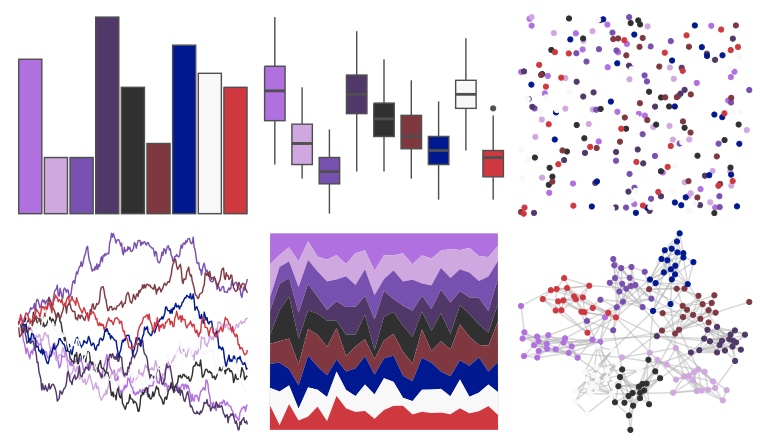

# palettetown - espeon 

::: columns
::: {.column width="50%"}

**Github**

[timcdlucas/palettetown](https://github.com/timcdlucas/palettetown)
:::

::: {.column width="50%"}

**CRAN**

[palettetown](https://CRAN.R-project.org/package=palettetown)
:::
:::

<hr> 

Use with [paletteer](https://emilhvitfeldt.github.io/paletteer/) package:

```r
library(paletteer)
paletteer_d("palettetown::espeon")
```

Use raw:

```r
c("#B070E0FF", "#D0A8E0FF", "#7850B0FF", "#503868FF", "#303030FF", "#803840FF", "#001890FF", "#F8F8F8FF", "#D03840FF")
``` 

 

<br>

# Related Palettes

<div class="list" style="display: grid; grid-template-columns: auto auto auto;"> <figure class="figure">
<a href="../../awtools/a_palette/"> </a>
</figure> <figure class="figure">
<a href="../../palettetown/haunter/"> </a>
</figure> <figure class="figure">
<a href="../../peRReo/planb/"> </a>
</figure> <figure class="figure">
<a href="../../Redmonder/qMSORdPu/"> </a>
</figure> <figure class="figure">
<a href="../../tvthemes/Sardonyx/"> </a>
</figure> <figure class="figure">
<a href="../../peRReo/badgyal/"> </a>
</figure> <figure class="figure">
<a href="../../palettetown/sableye/"> </a>
</figure> <figure class="figure">
<a href="../../palettetown/gligar/"> </a>
</figure> <figure class="figure">
<a href="../../palettetown/gorebyss/"> </a>
</figure> <figure class="figure">
<a href="../../palettetown/clamperl/"> </a>
</figure> <figure class="figure">
<a href="../../palettetown/forretress/"> </a>
</figure> <figure class="figure">
<a href="../../palettetown/granbull/"> </a>
</figure> 
</div>
