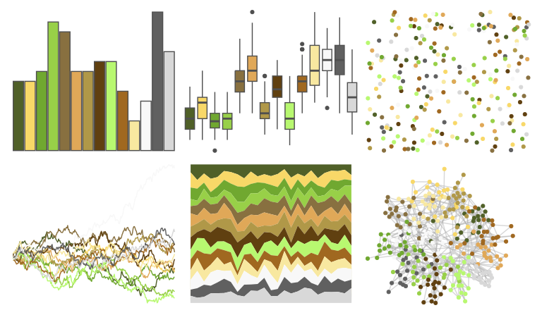
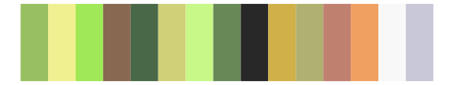
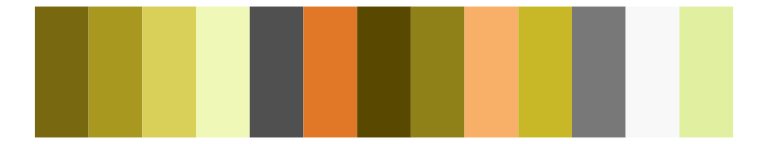
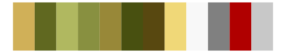
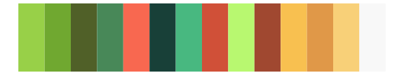
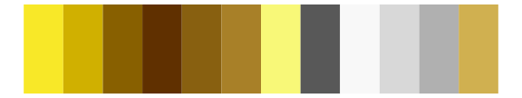
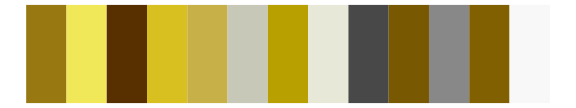

# palettetown - exeggutor 

::: columns
::: {.column width="50%"}

**Github**

[timcdlucas/palettetown](https://github.com/timcdlucas/palettetown)
:::

::: {.column width="50%"}

**CRAN**

[palettetown](https://CRAN.R-project.org/package=palettetown)
:::
:::

<hr> 

Use with [paletteer](https://emilhvitfeldt.github.io/paletteer/) package:

```r
library(paletteer)
paletteer_d("palettetown::exeggutor")
```

Use raw:

```r
c("#506028FF", "#F8D868FF", "#70A830FF", "#98D048FF", "#887040FF", "#E0A858FF", "#B09848FF", "#604010FF", "#B8F870FF", "#A06820FF", "#F8E8A0FF", "#F8F8F8FF", "#606060FF", "#D8D8D8FF")
``` 

 

<br>

# Related Palettes

<div class="list" style="display: grid; grid-template-columns: auto auto auto;"> <figure class="figure">
<a href="../../awtools/a_palette/"> </a>
</figure> <figure class="figure">
<a href="../../palettetown/ludicolo/"> </a>
</figure> <figure class="figure">
<a href="../../palettetown/hoothoot/"> </a>
</figure> <figure class="figure">
<a href="../../palettetown/caterpie/"> </a>
</figure> <figure class="figure">
<a href="../../palettetown/seedot/"> </a>
</figure> <figure class="figure">
<a href="../../palettetown/politoed/"> </a>
</figure> <figure class="figure">
<a href="../../palettetown/bayleef/"> </a>
</figure> <figure class="figure">
<a href="../../palettetown/golem/"> </a>
</figure> <figure class="figure">
<a href="../../palettetown/lombre/"> </a>
</figure> <figure class="figure">
<a href="../../palettetown/treecko/"> </a>
</figure> <figure class="figure">
<a href="../../palettetown/alakazam/"> </a>
</figure> <figure class="figure">
<a href="../../palettetown/sandslash/"> </a>
</figure> 
</div>
