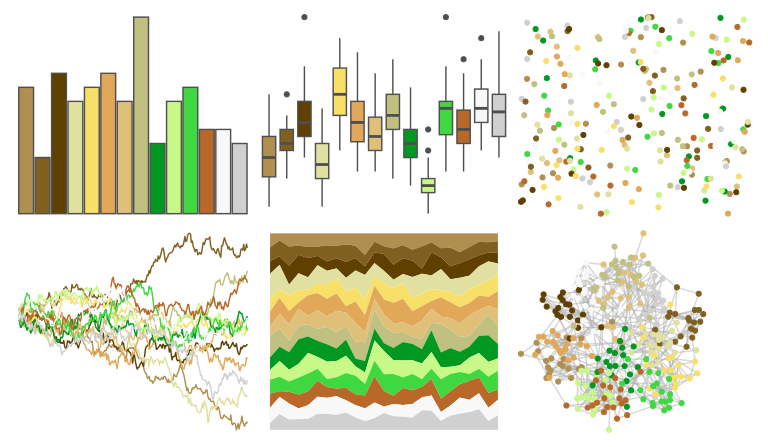

# palettetown - farfetchd 

::: columns
::: {.column width="50%"}

**Github**

[timcdlucas/palettetown](https://github.com/timcdlucas/palettetown)
:::

::: {.column width="50%"}

**CRAN**

[palettetown](https://CRAN.R-project.org/package=palettetown)
:::
:::

<hr> 

Use with [paletteer](https://emilhvitfeldt.github.io/paletteer/) package:

```r
library(paletteer)
paletteer_d("palettetown::farfetchd")
```

Use raw:

```r
c("#B09050FF", "#806020FF", "#604000FF", "#E0E0A0FF", "#F8E068FF", "#E0A858FF", "#E0C078FF", "#C0C080FF", "#009820FF", "#C8F888FF", "#40D840FF", "#B86828FF", "#F8F8F8FF", "#D0D0D0FF")
``` 

 

<br>

# Related Palettes

<div class="list" style="display: grid; grid-template-columns: auto auto auto;"> <figure class="figure">
<a href="../../awtools/a_palette/"> </a>
</figure> <figure class="figure">
<a href="../../palettetown/victreebel/"> </a>
</figure> <figure class="figure">
<a href="../../palettetown/weepinbell/"> </a>
</figure> <figure class="figure">
<a href="../../palettetown/bellsprout/"> </a>
</figure> <figure class="figure">
<a href="../../palettetown/skiploom/"> </a>
</figure> <figure class="figure">
<a href="../../palettetown/sudowoodo/"> </a>
</figure> <figure class="figure">
<a href="../../palettetown/sceptile/"> </a>
</figure> <figure class="figure">
<a href="../../palettetown/lombre/"> </a>
</figure> <figure class="figure">
<a href="../../palettetown/politoed/"> </a>
</figure> <figure class="figure">
<a href="../../palettetown/seedot/"> </a>
</figure> <figure class="figure">
<a href="../../palettetown/exeggutor/"> </a>
</figure> <figure class="figure">
<a href="../../palettetown/caterpie/"> </a>
</figure> 
</div>
