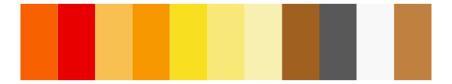

# palettetown - flareon 

::: columns
::: {.column width="50%"}

**Github**

[timcdlucas/palettetown](https://github.com/timcdlucas/palettetown)
:::

::: {.column width="50%"}

**CRAN**

[palettetown](https://CRAN.R-project.org/package=palettetown)
:::
:::

<hr> 

Use with [paletteer](https://emilhvitfeldt.github.io/paletteer/) package:

```r
library(paletteer)
paletteer_d("palettetown::flareon")
```

Use raw:

```r
c("#E8C808FF", "#F8F838FF", "#D06000FF", "#F88800FF", "#802020FF", "#A06800FF", "#F8F8C0FF", "#F8B028FF", "#F8F8F8FF", "#707078FF")
``` 

 

<br>

# Related Palettes

<div class="list" style="display: grid; grid-template-columns: auto auto auto;"> <figure class="figure">
<a href="../../awtools/a_palette/"> </a>
</figure> <figure class="figure">
<a href="../../palettetown/ponyta/"> </a>
</figure> <figure class="figure">
<a href="../../palettetown/rapidash/"> </a>
</figure> <figure class="figure">
<a href="../../palettetown/zapdos/"> </a>
</figure> <figure class="figure">
<a href="../../palettetown/pichu/"> </a>
</figure> <figure class="figure">
<a href="../../palettetown/pikachu/"> </a>
</figure> <figure class="figure">
<a href="../../palettetown/slugma/"> </a>
</figure> <figure class="figure">
<a href="../../palettetown/octillery/"> </a>
</figure> <figure class="figure">
<a href="../../palettetown/ledyba/"> </a>
</figure> <figure class="figure">
<a href="../../palettetown/raichu/"> </a>
</figure> <figure class="figure">
<a href="../../palettetown/ho_oh/"> </a>
</figure> <figure class="figure">
<a href="../../palettetown/magby/"> </a>
</figure> 
</div>
