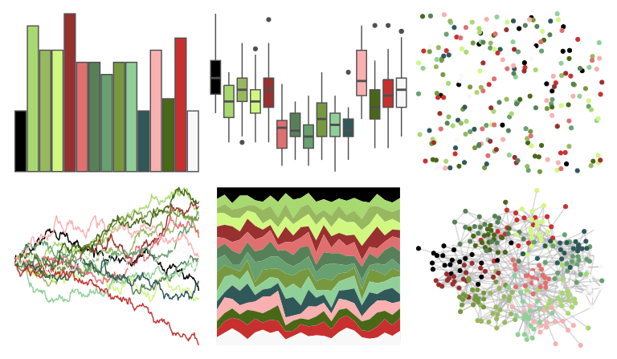
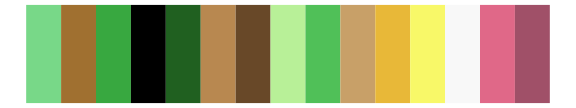
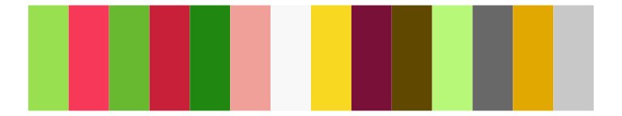
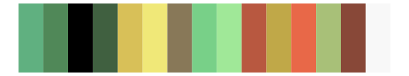
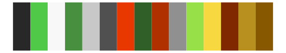
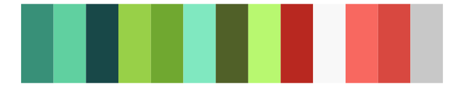
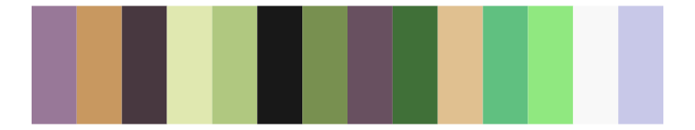
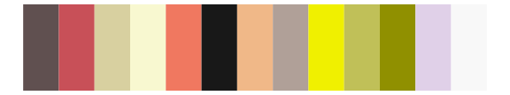

# palettetown - flygon 

::: columns
::: {.column width="50%"}

**Github**

[timcdlucas/palettetown](https://github.com/timcdlucas/palettetown)
:::

::: {.column width="50%"}

**CRAN**

[palettetown](https://CRAN.R-project.org/package=palettetown)
:::
:::

<hr> 

Use with [paletteer](https://emilhvitfeldt.github.io/paletteer/) package:

```r
library(paletteer)
paletteer_d("palettetown::flygon")
```

Use raw:

```r
c("#000000FF", "#A8D870FF", "#98B860FF", "#D0F880FF", "#983030FF", "#E07070FF", "#588058FF", "#68A070FF", "#789840FF", "#90D098FF", "#305858FF", "#F8B0B0FF", "#486818FF", "#C83030FF", "#F8F8F8FF")
``` 

 

<br>

# Related Palettes

<div class="list" style="display: grid; grid-template-columns: auto auto auto;"> <figure class="figure">
<a href="../../awtools/a_palette/"> </a>
</figure> <figure class="figure">
<a href="../../palettetown/tropius/"> </a>
</figure> <figure class="figure">
<a href="../../palettetown/meganium/"> </a>
</figure> <figure class="figure">
<a href="../../palettetown/kecleon/"> </a>
</figure> <figure class="figure">
<a href="../../palettetown/shiftry/"> </a>
</figure> <figure class="figure">
<a href="../../palettetown/natu/"> </a>
</figure> <figure class="figure">
<a href="../../palettetown/xatu/"> </a>
</figure> <figure class="figure">
<a href="../../palettetown/rayquaza/"> </a>
</figure> <figure class="figure">
<a href="../../palettetown/dustox/"> </a>
</figure> <figure class="figure">
<a href="../../palettetown/bulbasaur/"> </a>
</figure> <figure class="figure">
<a href="../../palettetown/nuzleaf/"> </a>
</figure> <figure class="figure">
<a href="../../palettetown/wurmple/"> </a>
</figure> 
</div>
