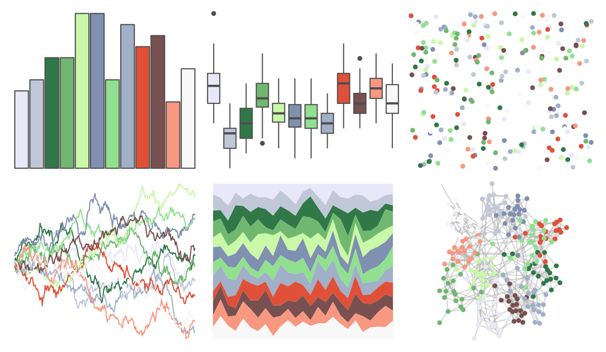
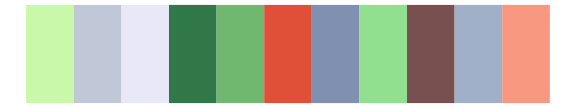

# palettetown - gardevoir 

::: columns
::: {.column width="50%"}

**Github**

[timcdlucas/palettetown](https://github.com/timcdlucas/palettetown)
:::

::: {.column width="50%"}

**CRAN**

[palettetown](https://CRAN.R-project.org/package=palettetown)
:::
:::

<hr> 

Use with [paletteer](https://emilhvitfeldt.github.io/paletteer/) package:

```r
library(paletteer)
paletteer_d("palettetown::gardevoir")
```

Use raw:

```r
c("#E8E8F8FF", "#C0C8D8FF", "#307848FF", "#70B870FF", "#C8F8A8FF", "#8090B0FF", "#90E090FF", "#A0B0C8FF", "#E05038FF", "#785050FF", "#F89880FF", "#F8F8F8FF")
``` 

 

<br>

# Related Palettes

<div class="list" style="display: grid; grid-template-columns: auto auto auto;"> <figure class="figure">
<a href="../../awtools/a_palette/"> </a>
</figure> <figure class="figure">
<a href="../../ButterflyColors/hamadryas_feronia/"> </a>
</figure> <figure class="figure">
<a href="../../ButterflyColors/hamadryas_feronia/"> </a>
</figure> <figure class="figure">
<a href="../../palettetown/kirlia/"> </a>
</figure> <figure class="figure">
<a href="../../palettetown/ralts/"> </a>
</figure> <figure class="figure">
<a href="../../palettetown/snorlax/"> </a>
</figure> <figure class="figure">
<a href="../../palettetown/magneton/"> </a>
</figure> <figure class="figure">
<a href="../../palettetown/seel/"> </a>
</figure> <figure class="figure">
<a href="../../palettetown/magnemite/"> </a>
</figure> <figure class="figure">
<a href="../../palettetown/rhydon/"> </a>
</figure> <figure class="figure">
<a href="../../palettetown/nidoqueen/"> </a>
</figure> <figure class="figure">
<a href="../../palettetown/kangaskhan/"> </a>
</figure> 
</div>
