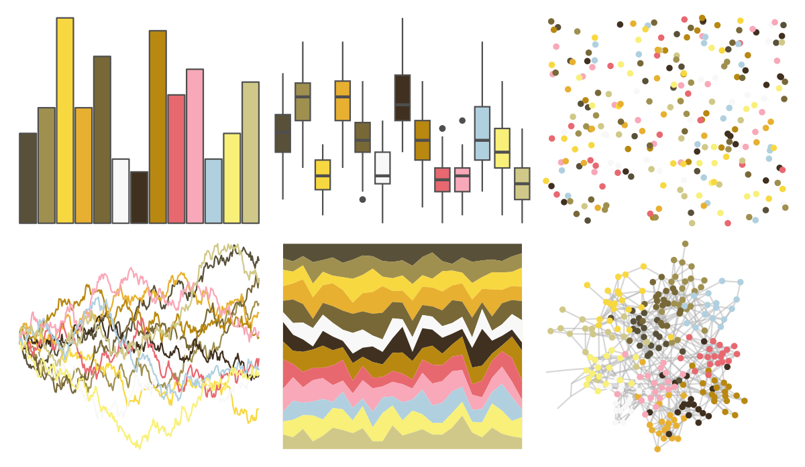

# palettetown - girafarig 

::: columns
::: {.column width="50%"}

**Github**

[timcdlucas/palettetown](https://github.com/timcdlucas/palettetown)
:::

::: {.column width="50%"}

**CRAN**

[palettetown](https://CRAN.R-project.org/package=palettetown)
:::
:::

<hr> 

Use with [paletteer](https://emilhvitfeldt.github.io/paletteer/) package:

```r
library(paletteer)
paletteer_d("palettetown::girafarig")
```

Use raw:

```r
c("#585038FF", "#A09050FF", "#F8D840FF", "#E8B030FF", "#786838FF", "#F8F8F8FF", "#403020FF", "#B88810FF", "#E86870FF", "#F8A8B8FF", "#B0D0E0FF", "#F8F078FF", "#D0C888FF")
``` 

 

<br>

# Related Palettes

<div class="list" style="display: grid; grid-template-columns: auto auto auto;"> <figure class="figure">
<a href="../../awtools/a_palette/"> </a>
</figure> <figure class="figure">
<a href="../../ButterflyColors/hamadryas_feronia/"> </a>
</figure> <figure class="figure">
<a href="../../ButterflyColors/hamadryas_feronia/"> </a>
</figure> <figure class="figure">
<a href="../../palettetown/golem/"> </a>
</figure> <figure class="figure">
<a href="../../palettetown/ursaring/"> </a>
</figure> <figure class="figure">
<a href="../../palettetown/noctowl/"> </a>
</figure> <figure class="figure">
<a href="../../palettetown/squirtle/"> </a>
</figure> <figure class="figure">
<a href="../../palettetown/machop/"> </a>
</figure> <figure class="figure">
<a href="../../palettetown/wurmple/"> </a>
</figure> <figure class="figure">
<a href="../../palettetown/kadabra/"> </a>
</figure> <figure class="figure">
<a href="../../palettetown/paras/"> </a>
</figure> <figure class="figure">
<a href="../../palettetown/claydol/"> </a>
</figure> 
</div>
