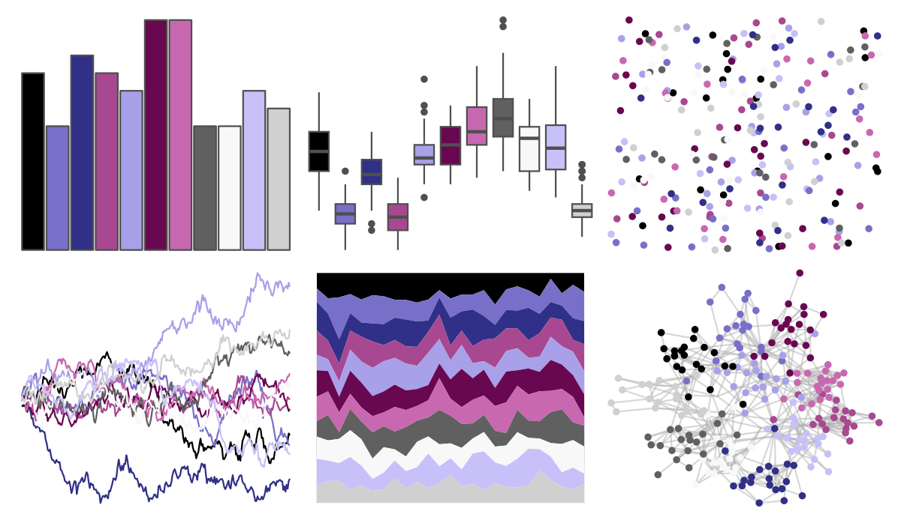

# palettetown - golbat 

::: columns
::: {.column width="50%"}

**Github**

[timcdlucas/palettetown](https://github.com/timcdlucas/palettetown)
:::

::: {.column width="50%"}

**CRAN**

[palettetown](https://CRAN.R-project.org/package=palettetown)
:::
:::

<hr> 

Use with [paletteer](https://emilhvitfeldt.github.io/paletteer/) package:

```r
library(paletteer)
paletteer_d("palettetown::golbat")
```

Use raw:

```r
c("#000000FF", "#7870C8FF", "#303088FF", "#A84890FF", "#A8A0E8FF", "#680850FF", "#C868B0FF", "#606060FF", "#F8F8F8FF", "#C8C0F8FF", "#D0D0D0FF")
``` 

 

<br>

# Related Palettes

<div class="list" style="display: grid; grid-template-columns: auto auto auto;"> <figure class="figure">
<a href="../../amerika/Dem_Ind_Rep3/"> </a>
</figure> <figure class="figure">
<a href="../../palettetown/gorebyss/"> </a>
</figure> <figure class="figure">
<a href="../../palettetown/clamperl/"> </a>
</figure> <figure class="figure">
<a href="../../palettetown/grumpig/"> </a>
</figure> <figure class="figure">
<a href="../../ggsci/slate_tw3/"> </a>
</figure> <figure class="figure">
<a href="../../ggsci/gray_tw3/"> </a>
</figure> <figure class="figure">
<a href="../../palettetown/sableye/"> </a>
</figure> <figure class="figure">
<a href="../../beyonce/X77/"> </a>
</figure> <figure class="figure">
<a href="../../RColorBrewer/BuPu/"> </a>
</figure> <figure class="figure">
<a href="../../palettetown/zubat/"> </a>
</figure> <figure class="figure">
<a href="../../palettetown/illumise/"> </a>
</figure> <figure class="figure">
<a href="../../peRReo/badgyal/"> </a>
</figure> 
</div>
