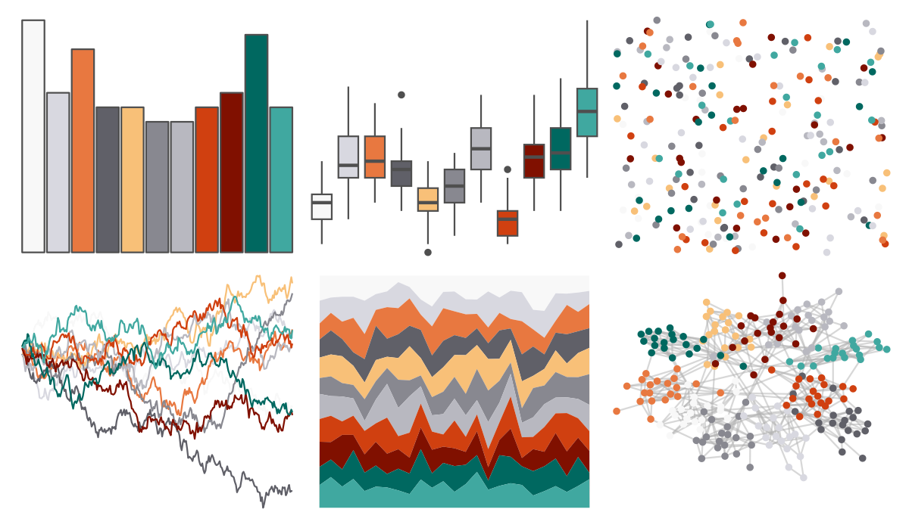

# palettetown - goldeen 

::: columns
::: {.column width="50%"}

**Github**

[timcdlucas/palettetown](https://github.com/timcdlucas/palettetown)
:::

::: {.column width="50%"}

**CRAN**

[palettetown](https://CRAN.R-project.org/package=palettetown)
:::
:::

<hr> 

Use with [paletteer](https://emilhvitfeldt.github.io/paletteer/) package:

```r
library(paletteer)
paletteer_d("palettetown::goldeen")
```

Use raw:

```r
c("#F8F8F8FF", "#D8D8E0FF", "#E87840FF", "#606068FF", "#F8C078FF", "#888890FF", "#B8B8C0FF", "#D04010FF", "#801000FF", "#006860FF", "#40A8A0FF")
``` 

 

<br>

# Related Palettes

<div class="list" style="display: grid; grid-template-columns: auto auto auto;"> <figure class="figure">
<a href="../../awtools/a_palette/"> </a>
</figure> <figure class="figure">
<a href="../../palettetown/electrode/"> </a>
</figure> <figure class="figure">
<a href="../../palettetown/wigglytuff/"> </a>
</figure> <figure class="figure">
<a href="../../ggsci/light_uchicago/"> </a>
</figure> <figure class="figure">
<a href="../../miscpalettes/dreaming/"> </a>
</figure> <figure class="figure">
<a href="../../palettetown/magneton/"> </a>
</figure> <figure class="figure">
<a href="../../palettetown/voltorb/"> </a>
</figure> <figure class="figure">
<a href="../../palettetown/azumarill/"> </a>
</figure> <figure class="figure">
<a href="../../palettetown/snubbull/"> </a>
</figure> <figure class="figure">
<a href="../../palettetown/masquerain/"> </a>
</figure> <figure class="figure">
<a href="../../beyonce/X75/"> </a>
</figure> <figure class="figure">
<a href="../../RColorBrewer/RdGy/"> </a>
</figure> 
</div>
