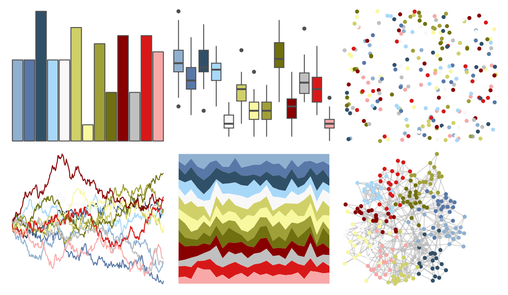

# palettetown - golduck 

::: columns
::: {.column width="50%"}

**Github**

[timcdlucas/palettetown](https://github.com/timcdlucas/palettetown)
:::

::: {.column width="50%"}

**CRAN**

[palettetown](https://CRAN.R-project.org/package=palettetown)
:::
:::

<hr> 

Use with [paletteer](https://emilhvitfeldt.github.io/paletteer/) package:

```r
library(paletteer)
paletteer_d("palettetown::golduck")
```

Use raw:

```r
c("#90B0D0FF", "#5878A8FF", "#305068FF", "#A8D8F8FF", "#F8F8F8FF", "#D0D068FF", "#F8F8A0FF", "#A0A038FF", "#707010FF", "#880000FF", "#C0C0C0FF", "#D81818FF", "#F8A8A8FF")
``` 

 

<br>

# Related Palettes

<div class="list" style="display: grid; grid-template-columns: auto auto auto;"> <figure class="figure">
<a href="../../awtools/a_palette/"> </a>
</figure> <figure class="figure">
<a href="../../palettetown/togepi/"> </a>
</figure> <figure class="figure">
<a href="../../palettetown/kingdra/"> </a>
</figure> <figure class="figure">
<a href="../../palettetown/horsea/"> </a>
</figure> <figure class="figure">
<a href="../../palettetown/qwilfish/"> </a>
</figure> <figure class="figure">
<a href="../../palettetown/nidoqueen/"> </a>
</figure> <figure class="figure">
<a href="../../palettetown/machoke/"> </a>
</figure> <figure class="figure">
<a href="../../palettetown/tentacool/"> </a>
</figure> <figure class="figure">
<a href="../../palettetown/feraligatr/"> </a>
</figure> <figure class="figure">
<a href="../../palettetown/chinchou/"> </a>
</figure> <figure class="figure">
<a href="../../palettetown/tentacruel/"> </a>
</figure> <figure class="figure">
<a href="../../palettetown/surskit/"> </a>
</figure> 
</div>
