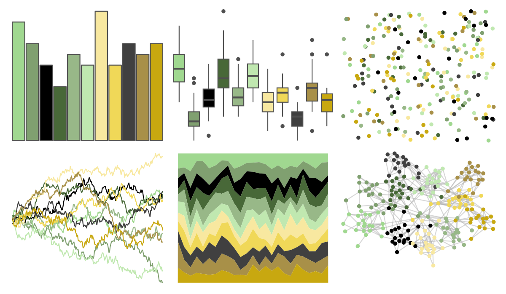

# palettetown - gulpin 

::: columns
::: {.column width="50%"}

**Github**

[timcdlucas/palettetown](https://github.com/timcdlucas/palettetown)
:::

::: {.column width="50%"}

**CRAN**

[palettetown](https://CRAN.R-project.org/package=palettetown)
:::
:::

<hr> 

Use with [paletteer](https://emilhvitfeldt.github.io/paletteer/) package:

```r
library(paletteer)
paletteer_d("palettetown::gulpin")
```

Use raw:

```r
c("#A0D890FF", "#80A070FF", "#000000FF", "#486838FF", "#98B888FF", "#C0E8B0FF", "#F8E8A0FF", "#F0D858FF", "#404040FF", "#A89048FF", "#C8A810FF")
``` 

 

<br>

# Related Palettes

<div class="list" style="display: grid; grid-template-columns: auto auto auto;"> <figure class="figure">
<a href="../../amerika/Dem_Ind_Rep3/"> </a>
</figure> <figure class="figure">
<a href="../../palettetown/shroomish/"> </a>
</figure> <figure class="figure">
<a href="../../palettetown/electrike/"> </a>
</figure> <figure class="figure">
<a href="../../palettetown/numel/"> </a>
</figure> <figure class="figure">
<a href="../../palettetown/kecleon/"> </a>
</figure> <figure class="figure">
<a href="../../palettetown/lotad/"> </a>
</figure> <figure class="figure">
<a href="../../palettetown/cradily/"> </a>
</figure> <figure class="figure">
<a href="../../palettetown/ludicolo/"> </a>
</figure> <figure class="figure">
<a href="../../palettetown/sandslash/"> </a>
</figure> <figure class="figure">
<a href="../../palettetown/chikorita/"> </a>
</figure> <figure class="figure">
<a href="../../palettetown/jolteon/"> </a>
</figure> <figure class="figure">
<a href="../../palettetown/exeggutor/"> </a>
</figure> 
</div>
